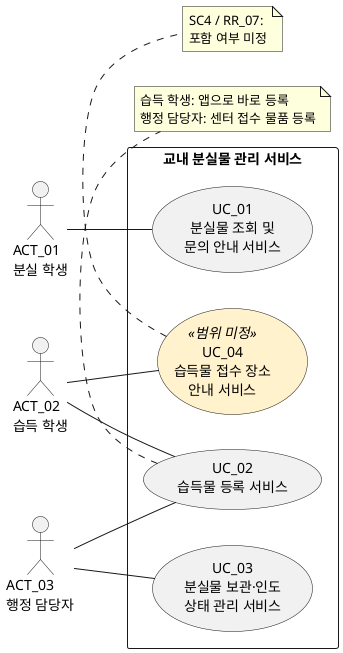

# 교내 분실물 관리 서비스 유스케이스 명세 v0.1

| 항목 | 내용 |
| --- | --- |
| 작성일 | 2026-10-08 |
| 분석 근거 | [고객 요구사항.md](고객%20요구사항.md), [SRS_v0.1.md](SRS_v0.1.md), 고객 검토 결과 |
| 시스템 경계 | 교내 분실물 관리 서비스 |
| 식별 기준 | 유스케이스는 화면·세부 기능이 아닌, 사용자가 하나의 목적을 달성하기 위해 이용하는 **서비스 단위**로 식별한다. |
| ID 규칙 | 액터는 `ACT_01`, 유스케이스는 `UC_01`, 질문은 `Q_01`부터 두 자리 일련번호를 부여한다. |
| 상태 해석 | **포함**은 개발 범위에 포함된 서비스다. **범위 미정**은 고객 결정 전인 서비스 후보다. |

## 1. 검토 결과 반영 및 원문과의 차이

| 항목 | 원문·기존 SRS의 내용 | 고객 검토 결과 | UC 반영 |
| --- | --- | --- | --- |
| 습득물 정보 등록의 주체 | 고객 요구사항의 목표, 이해관계자 표, `NEEDS_2`는 행정 담당자를 등록 주체로 명시한다. 습득 학생은 `NEEDS_5`에서 접수 장소를 알고 싶어 하는 역할로만 나타난다. | 습득 학생은 습득 물품을 앱으로 바로 등록하고, 행정 담당자는 분실물 센터로 접수된 습득 물품을 관리하기 위해 등록한다. | UC_02의 주 액터를 습득 학생과 행정 담당자로 식별했다. SRS `RR_03`, 정책 `Pol_02`, RTM `RTM_02`에 같은 확정 내용을 반영했다. 고객 요구사항 원문은 최초 출처로 유지한다. |
| 유스케이스 분할 기준 | 기존 UC는 보관 여부 조회·위치 확인, 문의 방법 확인, 현황 확인·상태 기록 등을 별도 유스케이스로 나누었다. | 유스케이스는 하나의 서비스 단위로 식별한다. | 조회와 문의 안내를 UC_01로, 현황 확인과 상태 기록을 UC_03으로 통합했다. |

기존에 행정 담당자를 등록 주체로 분석한 이유는 추정이 아니라 원문에 직접 적힌 내용 때문이었다. 이번 고객 검토 결과가 최신 결정이므로 습득 학생과 행정 담당자의 등록 업무를 모두 적용했다.

## 2. 액터 목록

동일한 학생도 물품을 잃어버린 상황에서는 분실 학생, 물품을 습득한 상황에서는 습득 학생 역할을 맡을 수 있다.

| 액터 ID | 액터 | 역할 및 사용자 목표 | 관련 유스케이스 | 식별 상태 |
| --- | --- | --- | --- | --- |
| ACT_01 | 분실 학생 | 찾는 물품의 보관 여부·위치와 담당 부서 문의 방법을 확인해 방문 또는 문의 여부를 판단한다. | UC_01 | 포함 |
| ACT_02 | 습득 학생 | 습득한 물품을 앱으로 즉시 등록해 분실 학생이 물품 정보를 찾을 수 있게 한다. | UC_02, UC_04 | UC_02는 확정. UC_04는 범위 미정. |
| ACT_03 | 행정 담당자 | 분실물 센터로 접수된 습득 물품을 등록하고, 보관 물품의 현재 상태를 관리해 보관 중인 물품과 인도 완료 물품을 구분한다. | UC_02, UC_03 | 포함 |

정보보호 담당자, 학생회, 학교의 서비스 운영 책임자는 정책 검토·의견 전달·책임 결정 역할은 있으나, 현재 요구사항에는 이들이 시스템에서 직접 수행할 서비스가 명시되어 있지 않다. 따라서 액터로 추가하지 않았다.

## 3. 유스케이스 목록

| UC ID | 서비스명 | 주 액터 | 사용자 목표 — 무엇을, 왜 | 서비스 결과 | 관련 요구사항 | 상태 및 질문 |
| --- | --- | --- | --- | --- | --- | --- |
| UC_01 | 분실물 조회 및 문의 안내 서비스 | ACT_01 분실 학생 | **분실 학생은 불필요한 방문을 줄이고 방문 또는 문의 여부를 판단하기 위해**, 물품의 보관 여부·보관 위치와 담당 부서 문의 방법을 확인한다. | 학생은 조회 가능한 물품의 보관 여부와 위치, 담당 부서 및 문의 방법을 확인한다. 개인 휴대전화 번호는 공개하지 않는다. | NEEDS_1, NEEDS_4, NEEDS_6; SC1, SC6, SC8; RR_01, RR_02, RR_06; NRF_03; Pol_01, Pol_05, Pol_06 | 포함. 조회 조건, 공개 항목, 인도 완료 물품 표시, 문의 수단은 Q_01~Q_04에서 확인한다. |
| UC_02 | 습득물 등록 서비스 | ACT_02 습득 학생, ACT_03 행정 담당자 | **습득 학생은 주운 물품이 분실 학생에게 발견될 수 있게 하기 위해** 앱으로 물품을 바로 등록한다. **행정 담당자는 분실물 센터로 접수된 습득 물품을 관리하기 위해** 물품을 등록한다. | 두 등록 경로에서 물품 정보가 저장되고, 공개 대상으로 정한 정보가 분실물 조회 서비스에 반영된다. | SC2; RR_03; Pol_01, Pol_02, Pol_04; 고객 검토 확정 2026-10-08 | 포함·확정. 등록 주체와 목적은 확정됐다. 등록 항목, 최초 상태, 습득 학생 등록 후 실물 전달·행정 담당자 수령 절차는 Q_05~Q_07에서 확인한다. |
| UC_03 | 분실물 보관·인도 상태 관리 서비스 | ACT_03 행정 담당자 | **행정 담당자는 보관 중인 물품과 이미 인도한 물품을 구분하고 정확한 현황으로 문의에 대응하기 위해**, 물품의 보관·인도 상태를 확인하고 기록한다. | 물품의 현재 상태가 보관 중 또는 인도 완료로 관리되며, 행정 담당자가 두 상태를 구분해 확인한다. | NEEDS_3; S2, SC3; RR_04, RR_05; Pol_02, Pol_03 | 포함. 상태 변경·정정 권한, 인도 완료 조건, 습득 학생이 등록한 물품의 수령·보관 전환 절차는 Q_07~Q_09에서 확인한다. |
| UC_04 | 습득물 접수 장소 안내 서비스 | ACT_02 습득 학생 | **습득 학생은 주운 물품을 적절한 장소에 전달하기 위해**, 습득물을 맡길 장소를 확인한다. | 포함 결정 시 학생이 접수 장소를 확인한다. | NEEDS_5; S3, SC4; RR_07; Pol_07 | **범위 미정**. UC_02의 온라인 등록과 함께 제공할지, 별도의 기존 안내로 둘지는 Q_10에서 확인한다. |

## 4. 유스케이스 다이어그램 — PlantUML

노란색은 범위 미정 서비스다. `UC_02`는 습득 학생과 행정 담당자가 각자의 등록 업무 맥락에서 수행한다.

현재 근거만으로 서비스 간 `include` 또는 `extend` 관계는 확정하지 않는다. 특히 습득 학생이 UC_02에서 등록한 물품을 행정 담당자가 언제 수령해 UC_03에서 보관 중 상태로 관리하는지는 별도 업무 절차 확인이 필요하다.

## 5. 공통 제약

| 근거 | 적용 서비스 | 적용 내용 |
| --- | --- | --- |
| NEEDS_6, NRF_03, Pol_01 | UC_01, UC_02 | 개인 휴대전화 번호는 공개하지 않는다. 조회에 공개할 항목과 두 등록 경로에서 수집할 항목은 고객 결정이 필요하다. |
| C_1, NRF_04 | UC_01~UC_04 | 개발·시연·검증에는 가상 데이터를 사용하며 실제 개인정보를 사용하지 않는다. |
| C_1, NRF_05, Pol_02 | UC_01~UC_03 | 학교 인증 연동은 제외한다. 역할 구분 및 관리 기능의 접근 방식은 확정되지 않았다. |
| SC5, SC7, SC8, Pol_07 | 전체 서비스 | 사진 기반 유사 물품 조회, 사진 매칭 결과 자동 알림, 개인 휴대전화 번호 공개는 이번 범위에서 제외한다. |

## 6. Use Case Description

각 표의 기본 흐름 번호는 해당 UC 안에서만 사용한다. 대안·예외 흐름은 **분기 지점 → 조건 → 대응 → 복귀 또는 종료** 순서로 기술한다. `[논의]`는 고객 결정이 필요한 사항 또는 분석자가 제안한 처리 초안이며, 확정 요구사항이나 인수 기준을 뜻하지 않는다. 미정 정책을 전제로 한 기본 흐름도 해당 부분에 태그를 붙였다. 실물 전달·인도와 시스템 기록은 구분한다.

### 6.1 UC_01 — 분실물 조회 및 문의 안내 서비스

| 항목 | Use Case Description |
| --- | --- |
| ID / 이름 | UC_01 / 분실물 조회 및 문의 안내 서비스 |
| 범위 / 상태 | 교내 분실물 관리 서비스 / 포함, 조회·공개·문의 세부 정책 미정 |
| 사용자와 목표 | ACT_01 분실 학생이 찾는 물품의 보관 여부·위치와 담당 부서 문의 방법을 확인하여 불필요한 방문을 줄이고 방문 또는 문의 여부를 판단한다. |
| 관련 고객 요구·정책 ID | 고객 요구: NEEDS_1, NEEDS_4, NEEDS_6; 출처·범위: S1, S4, S5, SC1, SC6, SC8, C_1; 기능: RR_01, RR_02, RR_06; 정책: Pol_01, Pol_02, Pol_05, Pol_06, Pol_07. |
| 관련 비기능·공통 제약 | NRF_03~NRF_05 적용. 개인 휴대전화 번호를 공개하지 않고, 개발·시연·검증에는 가상 정보를 사용하며 학교 인증과 연동하지 않는다. [논의] NRF_02의 조회 p95 2초 이하 목표는 제안값이다. |
| 사전조건 | 조회 서비스에 접근할 수 있다. 물품이 등록되어 있다는 사실은 사전조건이 아니다. [논의] 조회 접근 권한 및 역할 확인 방식은 Q_11에서 정한다. |
| 시작 사건 | 분실 학생이 방문 전에 찾는 물품 정보를 확인하려고 조회 서비스를 실행한다. |
| 기본 흐름 | 1. 학생이 조회 서비스를 연다. 2. 시스템이 조회 조건을 제시하고 학생이 조건을 입력·선택하여 조회를 요청한다. [논의] 조건과 조합은 Q_01에서 정한다. 3. 시스템이 조건에 맞는 공개 대상 물품을 조회하여 결과를 표시한다. [논의] 공개 대상과 표시 항목은 Q_02~Q_03에서 정한다. 4. 학생이 대상 물품을 선택한다. 5. 시스템이 등록된 보관 여부와, 보관 중인 경우 공개 가능한 보관 위치를 표시한다. 6. 시스템이 해당 물품의 담당 부서와 문의 방법을 표시한다. [논의] 구체적인 문의 수단은 Q_04에서 정한다. 7. 학생이 정보를 확인하고 방문 또는 문의 여부를 판단하면 종료한다. 실제 문의·방문·물품 인도는 이 UC의 완료 조건이 아니다. |
| 대안·예외 흐름 | A1 [논의] **2 → 조건 누락·형식 오류 →** 잘못된 조건과 수정 방법을 안내한다. **→ 2로 복귀.** 허용 조건·검증 규칙은 Q_01에서 합의한다. A2 [논의] **3 → 조회 결과 없음 →** 조건에 맞는 등록 정보가 없음을 안내한다. 결과 없음만으로 실제 미보관을 단정하지 않는다. 조건 변경 또는 일반 문의 안내를 제공할지는 Q_01·Q_04에서 정한다. **→ 조건 변경 시 2로 복귀, 종료 선택 시 종료.** A3 [논의] **4~5 → 선택 물품이 인도 완료 →** 공개 여부와 상태·위치 표시 정책에 따라 안내한다. 이미 인도한 물품을 현재 보관 중으로 안내하지 않는다. **→ 다른 물품 확인 시 3으로 복귀, 확인을 마치면 종료.** 구체적인 표시 방식은 Q_02에서 정한다. A4 [논의] **5~6 → 보관 위치 또는 부서 문의 정보 누락 →** 해당 정보를 확인할 수 없음을 안내하고 확인 가능한 정보만 제공한다. 대체 문의처 제공 여부는 Q_04에서 정한다. **→ 다른 물품 확인 시 3으로 복귀, 확인을 마치면 종료.** E1 [논의] **3 또는 5~6 → 조회·정보 로딩 실패 →** 조회 실패를 안내한다. 실패를 조회 결과 없음으로 표시하지 않는다. **→ 재시도 시 실패한 단계로 복귀, 취소 시 종료.** A5 **2~7 → 학생이 이용 중단 →** 조회를 종료한다. **→ 종료.** |
| 사후조건 — 성공 | 학생이 조회 대상의 공개 가능한 보관 정보 및 부서 문의 방법을 확인한다. 물품 정보와 보관·인도 상태는 변경되지 않는다. |
| 사후조건 — 실패·취소 / 보존 | 실패·취소한 조회는 보관 여부를 확정한 결과로 취급하지 않는다. 기존 물품 정보와 상태를 보존한다. [논의] 재시도 시 조회 조건 보존 여부와 보존 기간은 Q_12에서 정한다. |
| 미확정 사항·고객 질문 | [논의] Q_01: 검색 단서·조건 조합·결과 없음 안내는 무엇인가? Q_02: 위치 공개 수준과 인도 완료 물품 표시 방식은 무엇인가? Q_03: 공개 항목과 결정자는 누구인가? Q_04: 물품 미발견·문의 정보 누락 시 안내할 부서와 수단은 무엇인가? Q_11: 조회 접근 방식은 무엇인가? Q_12: 실패·취소 시 조건을 보존하는가? |

### 6.2 UC_02 — 습득물 등록 서비스

| 항목 | Use Case Description |
| --- | --- |
| ID / 이름 | UC_02 / 습득물 등록 서비스 |
| 범위 / 상태 | 교내 분실물 관리 서비스 / 포함. 학생 앱 등록과 행정 담당자 센터 접수 등록의 주체·목적은 확정, 세부 절차는 미정. |
| 사용자와 목표 | ACT_02 습득 학생은 습득한 물품을 앱으로 바로 등록하여 분실 학생이 발견할 수 있게 한다. ACT_03 행정 담당자는 센터로 접수된 물품을 등록하여 조회와 보관 관리에 활용하고 등록 부담을 줄인다. |
| 관련 고객 요구·정책 ID | 고객 요구: NEEDS_2, NEEDS_6, NEEDS_7; 출처·범위: S2, SC2, SC8, C_1, 고객 검토 확정 2026-10-08; 기능: RR_03; 정책: Pol_01, Pol_02, Pol_03, Pol_04, Pol_07. NEEDS_2 원문은 행정 담당자 등록이며 학생 앱 등록은 고객 검토 확정에 근거한다. |
| 관련 비기능·공통 제약 | NRF_03~NRF_05 적용. [논의] NRF_01의 평균 60초 이하 목표는 행정 담당자의 센터 접수 등록에 대한 제안이며 학생 등록에는 적용을 확정하지 않는다. |
| 사전조건 | 학생 경로: 학생이 등록할 물품을 습득했다. 행정 담당자 경로: 등록할 물품이 센터로 접수되었다. 각 액터가 자신의 등록 기능에 접근할 수 있다. [논의] 권한 확인 방식은 Q_11에서 정한다. 학생이 이미 실물을 센터에 전달했다는 조건은 확정하지 않는다. |
| 시작 사건 | 습득 학생이 앱으로 물품을 즉시 등록하려 하거나, 행정 담당자가 센터 접수 물품을 관리하기 위해 등록을 시작한다. |
| 기본 흐름 | 1. 사용자가 자신의 역할에 해당하는 등록 기능을 연다. 2. 시스템이 해당 등록 경로의 입력 항목을 제시한다. [논의] 필수·선택 항목 및 경로별 차이는 Q_05에서 정한다. 3. 사용자가 습득 물품 정보를 입력한다. 행정 담당자는 센터 접수 물품 정보를 입력한다. 4. 사용자가 등록을 요청한다. 5. 시스템이 합의된 입력 규칙과 처리 권한을 확인한다. [논의] 검증 규칙·권한 확인 방식은 Q_05·Q_11에서 정한다. 6. 시스템이 물품 정보를 저장한다. [논의] 등록 경로별 최초 상태는 Q_07에서 결정한 정책을 적용하며, 학생의 앱 등록만으로 센터 보관을 확정하지 않는다. 7. 시스템이 저장 완료를 안내하고 공개 대상으로 정한 정보를 UC_01의 조회에 반영한다. [논의] 학생 등록 정보의 공개 시점·수령 확인 필요 여부는 Q_07에서 정한다. 8. 사용자가 완료를 확인하면 종료한다. 학생의 실물 전달·행정 담당자 수령 절차는 Q_06~Q_07의 별도 협의 대상이다. |
| 대안·예외 흐름 | A1 [논의] **5 → 필수 항목 누락·형식 오류 →** 오류 항목과 수정 방법을 안내하고 유효한 입력은 유지하는 방안을 제안한다. **→ 3으로 복귀.** 규칙과 보존 범위는 Q_05·Q_12에서 정한다. A2 [논의] **5 → 동일 물품의 중복 등록 의심 →** 기존 등록 확인 후 새 등록을 계속할지 중단할지 안내하는 방안을 검토한다. 자동 중복 판정·병합은 확정 기능이 아니다. **→ 별도 물품으로 계속할 경우 5의 확인 후 6으로 진행, 중복이면 종료.** 판정 기준과 학생 등록 물품의 센터 재등록 여부는 Q_13에서 정한다. E1 [논의] **1 또는 5 → 등록 권한 없음 →** 등록을 허용하지 않고 허용된 접근 방법을 안내한다. **→ 종료.** 역할 확인 방식은 Q_11에서 정한다. E2 [논의] **6~7 → 저장 실패 또는 완료 응답 유실 →** 실패와 저장 여부 미확인을 구분하여 안내한다. 저장 여부를 확인한 후 재시도하는 방안을 제안한다. **→ 미저장이 확인되면 4로 복귀, 저장이 확인되면 7로 진행, 확인 불가·취소 시 종료.** 재시도 중복 방지·입력 보존은 Q_12~Q_13에서 정한다. A3 [논의] **3~5 → 저장 전 취소 →** 등록을 중단한다. **→ 종료.** 임시 저장·입력 폐기 여부는 Q_12에서 정한다. A4 [논의] **8 → 학생이 앱 등록 후 실물을 전달하지 않음 →** 온라인 등록과 센터 수령 여부를 구분하는 상태·안내 방안을 협의한다. **→ 이 UC는 저장 완료로 종료하며, 이후 전달·수령 절차는 Q_06~Q_07에서 정한다.** |
| 사후조건 — 성공 | 물품 정보가 저장되고 합의된 공개 정책에 따라 조회에 반영된다. 학생 앱 등록의 완료는 실물 전달·센터 수령 완료를 뜻하지 않는다. [논의] 최초 상태와 공개 시점은 Q_07의 결정에 따른다. |
| 사후조건 — 실패·취소 / 보존 | [논의] 저장 전 취소 또는 미저장이 확인된 실패는 새 등록을 만들지 않고 기존 물품 정보를 보존하는 것을 제안한다. 저장 여부가 불명확하면 성공·미저장을 단정하지 않고 확인이 필요하다. 이미 저장한 정보는 이용 중단만으로 삭제하지 않는 방안을 제안한다. 입력 보존·임시 저장·저장 단위는 Q_12에서 정한다. |
| 미확정 사항·고객 질문 | [논의] Q_05: 경로별 입력 항목과 검증 규칙은 무엇인가? Q_06: 실물 전달 장소·방식과 미전달 물품 처리는 무엇인가? Q_07: 최초 상태·수령 확인·공개 시점은 무엇인가? Q_11: 등록 역할을 어떻게 확인하는가? Q_12: 실패·취소 시 입력·저장 데이터를 어떻게 보존하는가? Q_13: 중복 등록과 재시도를 어떻게 처리하는가? NRF_01의 시간 목표·측정 조건은 적절한가? |

### 6.3 UC_03 — 분실물 보관·인도 상태 관리 서비스

| 항목 | Use Case Description |
| --- | --- |
| ID / 이름 | UC_03 / 분실물 보관·인도 상태 관리 서비스 |
| 범위 / 상태 | 교내 분실물 관리 서비스 / 포함, 상태 전환·정정·권한 세부 정책 미정 |
| 사용자와 목표 | ACT_03 행정 담당자가 물품의 현황을 확인하고 보관·인도 상태를 기록하여 보관 중인 물품과 이미 인도한 물품을 구분하고 정확한 현황으로 문의에 대응한다. |
| 관련 고객 요구·정책 ID | 고객 요구: NEEDS_3; 출처·범위: S2, SC3, C_1; 기능: RR_04, RR_05; 정책: Pol_02, Pol_03, Pol_07. 학생 조회에 반영되는 정보에는 NEEDS_6, Pol_01, Pol_05도 적용한다. |
| 관련 비기능·공통 제약 | NRF_04, NRF_05 적용. 학생에게 공개되는 정보에는 NRF_03을 적용한다. 학교 인증 제외가 관리 권한을 모든 사용자에게 부여한다는 뜻은 아니다. |
| 사전조건 | 행정 담당자가 상태 관리 기능에 접근할 수 있다. 상태 기록 대상 물품이 등록되어 있다. [논의] 담당자의 권한 확인 방식과 학생 등록 물품을 관리 대상으로 수령·확인하는 절차는 Q_07·Q_11에서 정한다. |
| 시작 사건 | 행정 담당자가 현재 보관·인도 현황을 확인하거나, 실제 보관·인도 사실을 상태에 반영하려고 관리 서비스를 실행한다. |
| 기본 흐름 | 1. 행정 담당자가 상태 관리 서비스를 연다. 2. 시스템이 관리 대상 물품과 현재 상태를 표시하여 보관 중·인도 완료를 구분할 수 있게 한다. 3. 담당자가 상태를 기록할 물품을 선택한다. 4. 담당자가 실제 보관·인도 사실을 확인하고 기록할 상태를 지정한다. [논의] 인도 사실 확인 기준과 허용 전환은 Q_07~Q_08에서 정한다. 5. 시스템이 담당자의 처리 권한과 상태 전환 조건을 확인한다. [논의] 세부 조건은 Q_08·Q_11에서 정한다. 6. 시스템이 지정한 상태를 저장한다. 7. 시스템이 저장된 현재 상태와 완료 안내를 표시한다. 학생 조회에는 합의된 공개 정책을 적용한다. 8. 담당자가 변경 결과를 확인하면 종료한다. |
| 대안·예외 흐름 | A1 **2 → 현황 확인만 필요 →** 담당자가 보관 중·인도 완료 상태를 확인한다. **→ 상태 변경 없이 종료.** A2 [논의] **3 → 대상 물품을 찾을 수 없음 →** 대상 확인이 필요함을 안내한다. **→ 다른 물품을 선택하려면 2로 복귀, 중단 시 종료.** 미등록 물품은 UC_02의 등록 대상인지 별도로 확인한다. A3 [논의] **4~5 → 인도 완료에 필요한 확인 미충족 →** 미충족 조건을 안내하고 상태 저장을 허용하지 않는다. **→ 조건을 확인한 뒤 4로 복귀, 취소 시 종료.** 구체적인 인도 확인 기준은 Q_08에서 정한다. A4 [논의] **4 → 잘못 기록한 상태를 정정하려 함 →** 정정 권한·허용 방향·절차를 확인한다. 인도 완료에서 보관 중으로 되돌리기는 자동 허용하지 않는다. **→ 허용된 정정이면 5로 진행, 불허 또는 취소 시 종료.** 정정 사유·이력 필요 여부는 Q_09·Q_14에서 정한다. E1 [논의] **1 또는 5 → 관리·변경 권한 없음 →** 해당 처리를 허용하지 않고 안내한다. **→ 종료.** E2 [논의] **5~6 → 다른 담당자가 같은 물품의 상태를 먼저 변경 →** 최신 상태를 확인한 후 다시 판단하는 방안을 제안한다. **→ 3으로 복귀, 취소 시 종료.** 충돌 판정·덮어쓰기 허용 여부는 Q_14에서 정한다. E3 [논의] **6~7 → 저장 실패 또는 완료 응답 유실 →** 저장 결과를 확인하여 미저장과 확인 불가를 구분한다. **→ 미저장이 확인되면 최신 상태 확인을 위해 3으로 복귀, 저장이 확인되면 7로 진행, 확인 불가·취소 시 종료.** 처리 방법은 Q_12에서 정한다. A5 **3~5 → 저장 전 취소 →** 상태 변경을 중단한다. **→ 종료.** |
| 사후조건 — 성공 | 현황 확인만 한 경우 담당자가 보관 중·인도 완료를 구분하며 기존 상태를 유지한다. 상태 기록까지 한 경우 저장된 상태와 다시 조회한 상태가 일치하고 인도 완료 물품이 보관 중으로 표시되지 않는다. 시스템 기록만으로 실물 인도가 수행되었다고 간주하지 않는다. |
| 사후조건 — 실패·취소 / 보존 | 저장 전 취소 또는 권한·전환 조건 미충족 시 기존 물품 정보와 상태를 유지한다. [논의] 저장 실패 시 부분 변경을 남기지 않는 방안을 제안한다. 완료 응답 유실 시 실제 저장 상태를 확인해야 하며 취소만으로 이전 상태로 되돌리지 않는다. 변경 이력의 보존 항목·기간은 Q_14에서 정한다. |
| 미확정 사항·고객 질문 | [논의] Q_07: 학생 등록 물품의 수령·보관 전환 절차는 무엇인가? Q_08: 인도 완료 확인 기준과 변경 권한은 무엇인가? Q_09: 정정 절차와 역방향 전환을 허용하는가? Q_11: 관리 권한은 어떻게 검증하는가? Q_12: 저장 실패·결과 미확인 시 처리 방법은 무엇인가? Q_14: 동시 변경과 변경·정정 이력은 어떻게 관리하는가? |

### 6.4 UC_04 — 습득물 접수 장소 안내 서비스

| 항목 | Use Case Description |
| --- | --- |
| ID / 이름 | UC_04 / 습득물 접수 장소 안내 서비스 |
| 범위 / 상태 | [논의] **범위 미정**. 아래 흐름은 서비스 포함 시 검토할 조건부 초안이며 필수 구현·인수 범위가 아니다. |
| 사용자와 목표 | ACT_02 습득 학생이 습득물을 맡길 장소를 확인하여 물품을 적절한 접수 장소에 전달할 수 있다. |
| 관련 고객 요구·정책 ID | 고객 요구: NEEDS_5; 출처·범위: S3, SC4, C_1; 기능: RR_07(조건부); 정책: Pol_07. 안내 정보의 책임 주체 결정은 Pol_08과 관련된다. |
| 관련 비기능·공통 제약 | 포함 시 NRF_04, NRF_05 적용. 실제 개인정보·학교 인증 연동을 사용하지 않는다. |
| 사전조건 | [논의] 고객이 이번 범위에 포함하기로 결정하고 접수 장소 안내 내용·제공 방식을 정했다. 학생이 안내 서비스에 접근할 수 있다. 물품 앱 등록 완료를 사전조건으로 둘지는 확정하지 않는다. |
| 시작 사건 | [논의] 습득 학생이 주운 물품을 맡길 장소를 확인하려고 접수 장소 안내를 요청한다. |
| 기본 흐름 | [논의] 1. 학생이 접수 장소 안내를 실행한다. 2. 시스템이 합의된 접수 장소 정보를 표시한다. 3. 학생이 안내를 확인하여 전달할 장소를 판단한다. 4. 학생이 확인을 마치면 종료한다. 실물 전달 완료와 UC_02 등록 완료는 이 UC의 완료 조건이 아니다. |
| 대안·예외 흐름 | A1 [논의] **1 → 이번 범위에서 제외하기로 결정 →** 앱 내 서비스를 제공하지 않는다. 기존 안내로 대체할지는 Q_10에서 정한다. **→ 이 UC를 실행하지 않음.** 이는 실행 중 오류가 아니라 범위 결정에 따른 분기다. A2 [논의] **2 → 안내할 장소가 없거나 정보가 미확인 →** 현재 장소를 안내할 수 없음을 표시한다. 기존 안내 또는 대체 확인 경로를 제공할지 협의한다. **→ 대체 안내 확인 후 종료, 재조회 선택 시 1로 복귀.** A3 [논의] **2 → 장소가 여러 곳이고 선택 기준이 필요 →** 선택 기준에 따라 적절한 장소를 안내할지 협의한다. **→ 기준 확인 후 2로 복귀, 취소 시 종료.** 장소 목록만 제공할지 별도 선택을 받을지는 Q_15에서 정한다. E1 [논의] **2 → 안내 정보 조회 실패 →** 실패를 안내한다. **→ 재시도 시 2로 복귀, 취소 시 종료.** A4 [논의] **1~3 → 학생이 이용 중단 →** 안내를 종료한다. **→ 종료.** |
| 사후조건 — 성공 | [논의] 포함 시 학생이 합의된 접수 장소 안내를 확인한다. 물품 등록·상태 정보는 변경하지 않으며 실물 접수 완료를 기록한 것으로 간주하지 않는다. |
| 사후조건 — 실패·취소 / 보존 | [논의] 안내 실패·취소 시 접수 장소를 확인한 것으로 간주하지 않는다. 기존 물품 정보·상태·안내 원본은 보존한다. 별도 입력을 도입할 경우 입력 보존 여부는 Q_12에서 정한다. |
| 미확정 사항·고객 질문 | [논의] Q_10: 기존 안내가 있으며 이번 서비스에 포함하는가? UC_02와 함께 제공하는가? Q_15: 접수 장소의 표시 수준·선택 기준과 안내 정보 관리 주체는 누구인가? 정보 누락 시 대체 안내는 무엇인가? |

## 7. 질문 사항

| 질문 ID | 관련 서비스 | 고객에게 확인할 질문 | 확인 대상 |
| --- | --- | --- | --- |
| Q_01 | UC_01 | [논의] 분실 학생은 어떤 단서로 물품을 검색하나요? 조회 결과가 없을 때 어떤 안내를 제공해야 하나요? | 분실 학생, 행정 담당자 |
| Q_02 | UC_01 | [논의] 보관 위치는 어느 수준까지 공개해야 하나요? 인도 완료 물품도 조회 결과에 표시하나요? | 분실 학생, 행정 담당자, 정보보호 담당자 |
| Q_03 | UC_01 | [논의] 개인 휴대전화 번호를 제외하고 분실 학생에게 공개할 정보는 무엇이며, 최종 결정자는 누구인가요? | 정보보호 담당자, 운영 책임자 |
| Q_04 | UC_01 | [논의] 어떤 담당 부서와 문의 수단을 안내하나요? 물품을 찾지 못한 경우에도 문의 방법을 제공하나요? | 행정 담당자, 운영 책임자 |
| Q_05 | UC_02 | [논의] 습득 학생의 앱 등록과 행정 담당자의 센터 접수 물품 등록에 각각 필요한 필수·선택 정보와 입력 규칙은 무엇인가요? 두 경로에 공통인 항목과 다른 항목은 무엇인가요? | 습득 학생, 행정 담당자, 정보보호 담당자 |
| Q_06 | UC_02 | [논의] 습득 학생이 앱으로 등록한 뒤 물품 실물은 어디에, 어떤 방식으로 전달하나요? 앱 등록만 하고 실물을 전달하지 않은 경우를 관리해야 하나요? | 습득 학생, 행정 담당자, 운영 책임자 |
| Q_07 | UC_02, UC_03 | [논의] 습득 학생 앱 등록과 행정 담당자 센터 접수 등록의 최초 상태는 각각 무엇인가요? 행정 담당자의 수령·확인 전에는 어떤 상태로 두며, 누가 보관 중 상태로 바꾸나요? | 행정 담당자, 운영 책임자 |
| Q_08 | UC_03 | [논의] 인도 완료는 어떤 사실을 확인한 뒤 기록하나요? 상태를 변경·정정할 권한은 누구에게 있나요? | 행정 담당자, 운영 책임자 |
| Q_09 | UC_03 | [논의] 잘못 기록한 상태를 어떤 절차로 정정하나요? 인도 완료에서 보관 중으로 되돌리는 처리를 허용하나요? | 행정 담당자, 운영 책임자 |
| Q_10 | UC_04 | [논의] 기존 습득물 접수 장소 안내가 있나요? UC_02의 등록 서비스와 함께 접수 장소 안내도 이번 서비스 범위에 포함하나요? | 습득 학생, 행정 담당자, 운영 책임자 |
| Q_11 | UC_01~UC_03 | [논의] 학교 인증 연동 없이 분실 학생·습득 학생·행정 담당자의 접근과 권한을 어떤 방식으로 구분하나요? | 운영 책임자, 정보보호 담당자 |
| Q_12 | UC_01~UC_04 | [논의] 조회·저장 실패 및 취소 시 입력 조건·작성 내용을 보존하나요? 임시 저장이 필요한가요? 보존 범위·기간은 무엇인가요? 저장 완료 응답을 받지 못했을 때 실제 저장 여부 확인과 재시도는 어떻게 처리하나요? | 운영 책임자, 정보보호 담당자, 개발 담당자 |
| Q_13 | UC_02 | [논의] 같은 물품인지 판단할 기준과 중복 등록 대응은 무엇인가요? 학생이 앱에 등록한 물품을 센터에서 수령하면 기존 등록을 활용하나요, 새로 등록하나요? 재시도로 중복 저장되는 상황은 어떻게 처리하나요? | 습득 학생, 행정 담당자, 운영 책임자, 개발 담당자 |
| Q_14 | UC_03 | [논의] 여러 담당자의 동시 상태 변경 시 충돌을 어떻게 처리하나요? 상태 변경·정정 사유 및 이력을 기록해야 하나요? 기록 항목·열람 권한·보존 기간은 무엇인가요? | 행정 담당자, 운영 책임자, 정보보호 담당자, 개발 담당자 |
| Q_15 | UC_04 | [논의] 포함 시 접수 장소의 표시 수준과 여러 장소의 선택 기준은 무엇인가요? 안내 정보의 관리 주체는 누구이며, 정보 누락·미확인 시 대체 안내는 무엇인가요? | 습득 학생, 행정 담당자, 운영 책임자 |

질문에 대한 답변으로 서비스 범위나 업무 절차가 확정되면 고객 요구사항, SRS, RTM과 이 문서를 함께 정합화한다.
