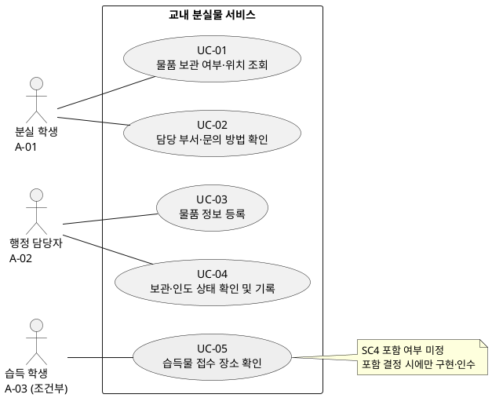

# 소프트웨어 요구사항 명세서 v0.1 — 분실물 서비스

| 항목 | 내용 |
| --- | --- |
| 작성일 | 2026-10-08 |
| 입력 | [고객 요구사항.md](고객%20요구사항.md) |
| 목적 | 학생이 방문 전에 보관 여부·위치·문의 방법을 확인하고, 행정 담당자가 물품을 등록하며 보관·인도 상태를 관리할 수 있도록 개발·검증 가능한 초안을 정의한다. |
| 문서 상태 | 고객 검토 전 초안. 원문에서 확정된 방향과 분석 과정에서 제안한 상세 동작을 구분한다. 구현·시험 완료를 뜻하지 않는다. |
| 기준 문서 | 이번 분석의 확정 근거는 지정된 입력 파일이다. 기존 SRS·UC·RTM은 별도 문서이며, 원문에 없는 ‘습득 학생 앱 등록 확정’은 이 문서의 확정 요구로 이관하지 않는다. [Q-12](#q-12)에서 확인한다. |
| 식별자 | 원문 ID 유지. `BR` 공통 정책·업무 규칙, `Q` 질문, `G` 사용자 목표, `A` 액터, `UC` 유스케이스, `FR` 기능, `NFR` 품질, `CON` 제약, `V` 검증 시나리오. 이 문서의 ID는 기존 초안의 ID와 독립적이다. |
| 추적표 | [8절 요구사항 추적표](#traceability). 표의 요구사항 ID는 원문 근거 또는 이 문서의 해당 요구사항으로 연결한다. |

**상태 표기:** **[확정]**은 원문에서 포함·제외 또는 요구 방향이 명시된 내용이다. **[질문]**은 결정되지 않은 사항이며 기본값이 아니다. **[제안]**은 분석자가 도출한 동작·수치·검증 방법으로 고객 승인 전 필수 인수 조건이 아니다. 범위 미정 항목은 **[질문·조건부]**로 표시한다. 한 항목에 상태가 섞이면 문장별로 구분한다.

UC의 목표와 핵심 결과는 원문에 연결하고, 단계 순서·대안·예외·실패 시 보존 조건은 별도 표시가 없는 한 **[제안]**이다. 질문이 남은 항목은 합의된 설정으로 개발·시험할 수 있도록 명세하되, 미정 값을 임의로 확정하지 않는다.

## 1. 원문 근거와 개발 경계

아래 표는 원문을 재해석하여 확정 범위를 늘리지 않기 위한 근거 색인이다. ‘원문’ 링크로 입력 문서의 해당 절을 확인할 수 있다.

| 근거 ID | 원문 내용 또는 요약 | 원문 위치 |
| --- | --- | --- |
| S1 | “방문 전에 보관 위치를 알고 싶어요.” | [3절 고객 인터뷰](고객%20요구사항.md#3-고객-인터뷰) |
| S2 | 반복 문의, 등록 시간 부족, 실제 인도한 물품의 구분 필요 | [3절](고객%20요구사항.md#3-고객-인터뷰) |
| S3 | 주운 물건을 맡길 곳의 안내 희망 | [3절](고객%20요구사항.md#3-고객-인터뷰) |
| S4 | 조회 화면의 연락처 공개 범위를 먼저 검토 | [3절](고객%20요구사항.md#3-고객-인터뷰) |
| S5 | 학생회의 사진 자동 매칭·휴대전화 번호 공개 제안. 채택 여부는 SC5~SC8에 따름 | [3절](고객%20요구사항.md#3-고객-인터뷰) |
| SC1 | 보관 여부·위치 조회 포함. 검색 조건·공개 정보 미정 | [4절 개발 범위](고객%20요구사항.md#4-개발-범위와-공통-제약) |
| SC2 | 물품 정보 등록 포함. 필수 입력 항목 미정 | [4절](고객%20요구사항.md#4-개발-범위와-공통-제약) |
| SC3 | 보관 중·인도 완료 상태 구분 포함. 처리 권한·정정 방법 미정 | [4절](고객%20요구사항.md#4-개발-범위와-공통-제약) |
| SC4 | 맡길 장소 안내의 프로그램 포함 여부 미정 | [4절](고객%20요구사항.md#4-개발-범위와-공통-제약) |
| SC5 | 사진을 올려 비슷한 분실물을 조회하는 기능 제외. 후속 후보 | [4절](고객%20요구사항.md#4-개발-범위와-공통-제약) |
| SC6 | 보관 담당 부서와 문의 방법 안내 포함. 표시 내용 미정 | [4절](고객%20요구사항.md#4-개발-범위와-공통-제약) |
| SC7 | 사진 매칭 결과 자동 알림 제외 | [4절](고객%20요구사항.md#4-개발-범위와-공통-제약) |
| SC8 | 개인 휴대전화 번호 공개 제외 | [4절](고객%20요구사항.md#4-개발-범위와-공통-제약) |
| C_1 | “가상 데이터를 사용하며 실제 개인정보와 학교 인증 연동은 제외한다.” | [4절 공통 제약](고객%20요구사항.md#4-개발-범위와-공통-제약) |
| NEEDS_1 | 분실 학생의 방문 전 보관 여부·위치 확인. 상세 미정 | [5절 고객 요구](고객%20요구사항.md#5-고객-요구사항-요약) |
| NEEDS_2 | 행정 담당자의 물품 정보 등록. 항목·권한 미정 | [5절](고객%20요구사항.md#5-고객-요구사항-요약) |
| NEEDS_3 | 행정 담당자의 상태 기록·구분. 처리·정정 조건 미정 | [5절](고객%20요구사항.md#5-고객-요구사항-요약) |
| NEEDS_4 | 분실 학생의 담당 부서·문의 방법 확인. 표시 내용 미정 | [5절](고객%20요구사항.md#5-고객-요구사항-요약) |
| NEEDS_5 | 습득 학생의 맡길 장소 확인. 프로그램 포함 미정 | [5절](고객%20요구사항.md#5-고객-요구사항-요약) |
| NEEDS_6 | 조회 목적에 맞는 공개 범위 결정. 개인 휴대전화 번호 비공개 | [5절](고객%20요구사항.md#5-고객-요구사항-요약) |
| NEEDS_7 | 행정 담당자의 등록 부담 감소. 원인·측정 방법·목표 미정 | [5절](고객%20요구사항.md#5-고객-요구사항-요약) |
| 원문 1절 | 방문 전 확인, 등록·상태 관리, 등록 부담 감소가 목표. 현재 시간·개선 수치 미정 | [1절 문제와 목표](고객%20요구사항.md#1-문제와-목표) |
| 원문 2절 | 정보보호 담당자는 공개 범위를 검토하고, 학생회는 의견을 전달한다. 운영 책임자는 정책·책임을 결정하며 실제 담당 주체는 미정 | [2절 이해관계자](고객%20요구사항.md#2-이해관계자) |

**시스템 경계:** 소프트웨어는 등록된 물품 정보와 상태를 제공·기록한다. 물품의 실제 수령·보관·인도 및 소유자 확인은 현장 업무이며, 그 사실을 시스템이 자동 판정한다고 가정하지 않는다. [제안] 조회 결과가 없다는 이유만으로 실제 미보관을 단정하지 않는다. 접수 장소 안내의 포함 여부는 [Q-06](#q-06)에 따른다. 사진 유사 조회·매칭 결과 자동 알림·개인 번호 공개는 제외한다. 사진 유사 조회의 제외만으로 별도의 사진 첨부 기능이 승인된 것으로 해석하지 않는다.

## 2. 공통 정책·업무 규칙

| ID | 정책·업무 규칙 및 상태 | 원문 근거 | 적용·결정 항목 |
| --- | --- | --- | --- |
| BR-01 | [확정] 조회·등록·상태 구분·문의 방법 안내 포함. 사진 유사 조회·매칭 결과 자동 알림·개인 번호 공개 제외. [질문] 맡길 장소 안내의 포함 여부 | [SC1](#src-sc1)~[SC8](#src-sc8) | 전체 UC; [Q-06](#q-06), [CON-04](#con-04) |
| BR-02 | [확정] 개인 휴대전화 번호를 공개하지 않는다. [질문] 나머지 학생 공개 항목·위치의 표현 수준·인도 완료 물품 공개 범위. [제안] 승인된 공개 항목 목록에 없는 정보는 학생에게 제공하지 않는다 | [NEEDS_6](#src-needs6), [S4](#src-s4), [SC1](#src-sc1), [SC8](#src-sc8) | 조회·문의·조건부 안내; [Q-01](#q-01), [CON-01](#con-01) |
| BR-03 | [확정] 행정 담당자가 등록·상태 관리를 수행한다. [질문] 조회 접근 조건, 상세 권한, 정정 권한, 학교 인증 없이 역할을 구분할 방법. [제안] 시연용 역할을 구분하고 관리 요청마다 권한을 검사한다 | [NEEDS_2](#src-needs2), [NEEDS_3](#src-needs3), [C_1](#src-c1) | [Q-03](#q-03), [NFR-03](#nfr-03). 학교 인증 제외를 권한 검사 제외로 해석하지 않음 |
| BR-04 | [확정] 관리 상태는 ‘보관 중’과 ‘인도 완료’를 구분하고 실제 인도 사실을 반영한다. [제안] 실물 접수 확인 후 등록하고 최초 상태를 ‘보관 중’으로 설정하며, 실제 인도 확인 후 ‘인도 완료’로 전환한다. [질문] 최초 상태·확인 기준·정정 허용 조건 | [S2](#src-s2), [SC3](#src-sc3), [NEEDS_3](#src-needs3) | [Q-04](#q-04). 제안된 전환은 승인 전 업무 규칙이 아님 |
| BR-05 | [확정] 조회·관리에 필요한 물품 정보를 등록한다. [질문] 필수·선택 항목, 형식·길이·허용값. [제안] 입력 검증 통과 후 물품 단위로 저장하고 오류가 있으면 해당 항목을 안내한다 | [NEEDS_2](#src-needs2), [SC2](#src-sc2) | [Q-02](#q-02), [4.1절 데이터 계약](#data-contract) |
| BR-06 | [확정] 담당 부서와 문의 방법을 안내한다. [질문] 문의 수단·문구·관리 주체·물품 미발견 시 공통 문의처. [제안] 문의 안내 열람으로 UC를 완료하고 메시지 발송·접수 기능은 도출하지 않는다 | [NEEDS_4](#src-needs4), [SC6](#src-sc6), [SC7](#src-sc7), [SC8](#src-sc8) | [Q-05](#q-05), [UC-02](#uc-02) |
| BR-07 | [제안] 0건 결과는 ‘등록된 정보에서 일치하는 물품 없음’으로 안내한다. 조회 실패는 0건과 구분한다. 보관 여부는 마지막으로 저장된 상태에 근거하며 현장과 실시간으로 일치한다고 보장하지 않는다. [질문] 검색 조건·정렬·학생 상태 노출 | [NEEDS_1](#src-needs1), [SC1](#src-sc1)에서 도출 | [Q-01](#q-01), [UC-01](#uc-01) |
| BR-08 | [제안] 저장은 전부 반영하거나 반영하지 않는다. 저장 응답 유실 시 결과를 ‘확인 필요’로 안내하고 동일 요청 확인 후 재시도하여 중복 반영을 막는다. 동시 상태 변경 시 오래된 상태로 덮어쓰지 않는다. [질문] 입력 보존·재시도·충돌 정책 | [NEEDS_2](#src-needs2), [NEEDS_3](#src-needs3)에서 도출; 원문에 오류 처리 규칙 없음 | [Q-08](#q-08), [Q-09](#q-09), [NFR-04](#nfr-04) |
| BR-09 | [확정] 운영 책임자가 운영 정책·책임을 결정한다. [질문] 실제 책임자 및 항목별 결정자. [제안] 정책 결정 시 결정자·결정일·영향 ID를 기록하고 UC·검증·추적표를 함께 갱신한다 | [원문 2절](#src-owner) | [Q-10](#q-10) |
| BR-10 | [확정] 가상 데이터만 사용하고 실제 개인정보 및 학교 인증 연동을 제외한다 | [C_1](#src-c1) | 모든 UC·시험; [CON-02](#con-02), [CON-03](#con-03) |

### 2.1 미정 질문과 결정 영향

질문 담당은 **협의 대상 제안**이다. 운영 책임자 자체가 미정이므로 특정인의 승인을 이미 받은 것으로 간주하지 않는다.

| ID | 고객에게 확인할 질문 | 협의 대상 | 결정 전 영향 |
| --- | --- | --- | --- |
| Q-01 | 어떤 단서로 조회하는가? 검색 조건·일치 규칙·정렬은 무엇인가? 학생에게 공개할 항목, 위치 단위, 인도 완료 물품의 노출 방식은 무엇인가? 0건·정보 누락 시 어떤 안내를 제공하는가? | 분실 학생, 행정 담당자, 정보보호 담당자, 운영 책임자 | [FR-01](#fr-01), [FR-02](#fr-02), [CON-01](#con-01)의 최종 데이터·조회 시험 보류 |
| Q-02 | 등록의 필수·선택 항목과 허용값·길이·입력 형식은 무엇인가? 위치·담당 부서·문의 방법은 물품마다 입력하는가, 사전 정의된 목록을 참조하는가? | 행정 담당자, 정보보호 담당자 | [FR-03](#fr-03)의 입력 계약과 경계값 시험 보류 |
| Q-03 | 누가 조회·등록·상태 변경·정정을 수행할 수 있는가? 학교 인증 없이 어떤 시연용 역할·계정으로 구분하는가? | 운영 책임자, 행정 담당자, 정보보호 담당자 | [BR-03](#br-03), [NFR-03](#nfr-03)의 권한표 확정 필요 |
| Q-04 | 등록 시 실물 수령을 확인하는가? 최초 상태는 무엇인가? 실제 인도 확인 기준은 무엇인가? 잘못 기록한 상태를 되돌릴 수 있는가? 정정 사유·이력을 기록한다면 항목·열람 권한·보존 기간은 무엇인가? | 행정 담당자, 운영 책임자 | [FR-03](#fr-03), [FR-04](#fr-04)의 상태 전환·정정 시험 보류. 소유자 인증 기능은 자동 추가하지 않음 |
| Q-05 | 어떤 가상 부서·문의 수단·문구를 표시하는가? 미등록 물품을 위한 공통 문의처도 필요한가? 안내를 누가 갱신하는가? | 행정 담당자, 정보보호 담당자, 운영 책임자 | [FR-06](#fr-06)의 표시 데이터와 정보 누락 대응 확정 필요 |
| Q-06 | 기존 접수 장소 안내가 있는가? 프로그램 안내가 필요한가? 포함한다면 장소 단위·여러 장소의 선택 기준·안내 관리자는 누구인가? | 습득 학생, 행정 담당자, 운영 책임자 | [UC-05](#uc-05), [FR-07](#fr-07)는 결정 전 필수 구현·인수 대상에서 제외 |
| Q-07 | 등록 부담의 주원인은 무엇인가? 현행 등록 시간·오류·재입력 빈도는 얼마인가? 제안한 등록 시간 및 조회 성능 목표·시험 환경을 채택하는가? | 행정 담당자, 운영 책임자, 개발·검증 담당자 | [NFR-01](#nfr-01), [NFR-02](#nfr-02)의 수치 승인 필요 |
| Q-08 | 실패·취소·권한 상실 시 입력을 어디에 얼마나 보존하는가? 임시 저장이 필요한가? 응답 유실 후 저장 결과 확인·동일 요청 재시도 방식을 채택하는가? | 행정 담당자, 운영 책임자, 개발·검증 담당자 | UC 실패 시 보존 조건 및 [NFR-04](#nfr-04)의 확정 필요 |
| Q-09 | 동시에 상태를 바꾸면 충돌을 어떻게 해결하는가? 별개 등록 요청이 같은 실물인지 판단할 기준과 중복 등록 대응이 필요한가? | 행정 담당자, 운영 책임자, 개발·검증 담당자 | [UC-03](#uc-03)·[UC-04](#uc-04)의 예외 처리 확정. 요청 재전송 중복과 동일 실물의 별개 등록을 구분 |
| Q-10 | 실제 운영 책임자는 누구이며 공개 정보·권한·상태·안내·품질 목표를 각각 누가 최종 결정하는가? | 학교 측 이해관계자 | [BR-09](#br-09) 및 질문 종결 책임 확정 |
| Q-11 | 대상 단말·브라우저, 배포 환경, 예상 사용자·물품 수는 무엇인가? 추가 가용성·백업/복구·접근성 목표가 필요한가? | 운영 책임자, 개발·검증 담당자, 학생 | [NFR-02](#nfr-02) 시험 환경 확정. 원문에 없는 플랫폼·기술 스택·품질 수치를 확정하지 않음 |
| Q-12 | 기존 초안의 ‘습득 학생 앱 등록, 고객 검토 확정 2026-10-08’에 대한 승인 근거가 있는가? 지정된 원문에도 반영할 것인가? | 고객 요구 작성자, 운영 책임자 | 이번 초안은 [NEEDS_2](#src-needs2)에 따라 행정 담당자만 등록 액터로 명세. 승인 근거 확인 후 범위·최초 상태·실물 접수 절차 재분석 |

## 3. 사용자 목표·액터·유스케이스

### 3.1 사용자 목표

| ID | 누가 | 무엇을 | 왜 | 상태·근거 | 대응 UC |
| --- | --- | --- | --- | --- | --- |
| G-01 | 분실 학생 | 물품의 보관 여부·위치 확인 | 불필요한 행정실 방문을 줄이고 방문할 곳을 판단 | [확정] [NEEDS_1](#src-needs1), [S1](#src-s1) | [UC-01](#uc-01) |
| G-02 | 분실 학생 | 보관 담당 부서·문의 방법 확인 | 물품에 대해 담당 부서에 문의할 방법을 알기 위해 | [확정] [NEEDS_4](#src-needs4), [SC6](#src-sc6) | [UC-02](#uc-02) |
| G-03 | 행정 담당자 | 필요한 물품 정보 등록 | 학생 조회와 관리를 가능하게 하고 등록 부담을 줄이기 위해 | [확정] [NEEDS_2](#src-needs2), [NEEDS_7](#src-needs7), [S2](#src-s2) | [UC-03](#uc-03) |
| G-04 | 행정 담당자 | 보관·인도 상태 기록 및 구분 | 이미 인도한 물품을 보관 중인 물품과 혼동하지 않기 위해 | [확정] [NEEDS_3](#src-needs3), [S2](#src-s2) | [UC-04](#uc-04) |
| G-05 | 습득 학생 | 물품을 맡길 장소 확인 | 주운 물품을 적절한 접수 장소로 전달하기 위해 | [질문·조건부] [NEEDS_5](#src-needs5), [SC4](#src-sc4) | [UC-05](#uc-05) |

### 3.2 액터와 이해관계자

액터는 시스템과 직접 상호작용하는 역할이다. 검토·정책 결정 역할만 주어진 이해관계자를 관리 화면 사용자로 임의 지정하지 않는다. 한 사람이 여러 역할을 맡을 수 있으나 권한은 [Q-03](#q-03)에서 정한다.

| ID | 역할 | 시스템 상호작용 및 범위 | 근거 |
| --- | --- | --- | --- |
| A-01 | 분실 학생 | 보관 정보·문의 안내를 조회하는 주 액터 | [원문 2절](#src-owner), [NEEDS_1](#src-needs1), [NEEDS_4](#src-needs4) |
| A-02 | 행정 담당자 | 물품 등록·상태 확인·변경의 주 액터. 상세 권한 미정 | [NEEDS_2](#src-needs2), [NEEDS_3](#src-needs3) |
| A-03 | 습득 학생 | 프로그램 안내 포함 시 접수 장소를 조회하는 조건부 액터 | [NEEDS_5](#src-needs5), [SC4](#src-sc4) |
| 이해관계자 | 정보보호 담당자 | 공개 범위 검토. 별도 시스템 이용 UC 근거 없음 | [원문 2절](#src-owner), [S4](#src-s4) |
| 이해관계자 | 학생회 | 학생 의견 전달. 별도 시스템 이용 UC 근거 없음 | [원문 2절](#src-owner), [S5](#src-s5) |
| 이해관계자 | 학교의 서비스 운영 책임자 | 정책·책임 결정. 실제 담당자 미정. 별도 설정 화면은 범위 미확정 | [원문 2절](#src-owner) |

### 3.3 유스케이스 목록

| ID | UC 명 | 주 액터 | 달성 결과 | 범위 |
| --- | --- | --- | --- | --- |
| [UC-01](#uc-01) | 물품 보관 여부·위치 조회 | [A-01](#a-01) | 등록된 보관 정보와 위치 또는 일치 정보 없음을 확인 | 포함; 조회·공개 상세 질문 |
| [UC-02](#uc-02) | 담당 부서·문의 방법 확인 | [A-01](#a-01) | 보관 담당 부서의 문의 방법 확인 | 포함; 표시 상세 질문 |
| [UC-03](#uc-03) | 물품 정보 등록 | [A-02](#a-02) | 물품 정보 저장 및 재조회 가능 | 포함; 입력·권한·최초 상태 질문 |
| [UC-04](#uc-04) | 보관·인도 상태 확인 및 기록 | [A-02](#a-02) | 상태를 구분해 확인하고 실제 인도 사실 반영 | 포함; 처리·정정 조건 질문 |
| [UC-05](#uc-05) | 습득물 접수 장소 확인 | [A-03](#a-03) | 맡길 장소 확인 | 조건부; 포함 여부 질문 |

### 3.4 유스케이스 다이어그램

다음 코드는 PlantUML 입력으로 사용할 수 있다. 회색 UC는 범위 미정이다. 연관선은 액터의 참여를 나타내며 실행 순서가 아니다. UC-02는 UC-01 결과에서 접근할 수 있으나 항상 수행되는 필수 단계가 아니므로 `include` 관계를 부여하지 않는다. 현장 인도·학교 인증·사진 매칭·알림을 시스템 UC로 포함하지 않는다.

| 액터 ID | UC ID | 연결 의미 | 적용 조건 |
| --- | --- | --- | --- |
| [A-01](#a-01) | [UC-01](#uc-01) | 보관 여부·위치 조회 요청 및 결과 확인 | 조회 접근·공개 정책 확정 |
| [A-01](#a-01) | [UC-02](#uc-02) | 담당 부서·문의 방법 안내 요청 및 확인 | 조회 접근·안내 정책 확정 |
| [A-02](#a-02) | [UC-03](#uc-03) | 물품 등록 요청 및 저장 결과 확인 | 등록 권한·입력 계약 확정 |
| [A-02](#a-02) | [UC-04](#uc-04) | 상태 확인 및 변경 요청 | 조회·변경·정정 권한 구분 |
| [A-03](#a-03) | [UC-05](#uc-05) | 접수 장소 안내 요청 및 확인 | SC4 포함 결정 |

## 4. 유스케이스 명세

표의 `B`는 기본 흐름, `A`는 정상적인 대안 흐름, `E`는 오류·거부 흐름이다. 각 흐름은 발생 단계와 복귀·종료 지점을 명시한다. 조건·절·단계 ID는 기능 요구사항 및 검증과 연결된다. [확정]인 목표·범위와 달리 아래 상세 동작은 고객 검토를 위한 **[제안]**이며, [질문]의 답변에 따라 수정한다.

### 4.1 공통 데이터 계약 초안

다음은 구현 검토를 위한 **[제안]**이며 확정된 필수 입력 목록이 아니다. 시스템 생성값, 관리 입력값, 학생 공개값을 구분한다. 저장값과 표시값의 일치 여부는 승인된 이 계약을 기준으로 검증한다.

| 데이터 | 제안 정의·검증 | 미정 사항 |
| --- | --- | --- |
| 물품 식별자 | 시스템이 생성하는 고유값. 재조회·상태 변경은 이 값으로 대상을 식별 | 표시 형식·학생 공개 여부: [Q-01](#q-01), [Q-02](#q-02) |
| 물품 설명 | 학생이 물품을 구분할 수 있는 명칭·특징 등. 승인된 항목별 입력 규칙 검사 | 구체 항목·필수성·형식·길이·공개 범위: [Q-01](#q-01), [Q-02](#q-02) |
| 보관 위치 | 보관 중인 물품은 위치를 식별할 수 있는 값을 보유. 학생 표시는 승인된 단위로 변환 | 건물·부서·실 단위 및 선택 목록: [Q-01](#q-01), [Q-02](#q-02) |
| 상태 | ‘보관 중’·‘인도 완료’를 구분. 승인되지 않은 상태값 저장 거부 | 최초 상태·전환·정정: [Q-04](#q-04) |
| 담당 부서·문의 방법 | 물품의 담당 부서와 연결되는 가상 문의 정보. 개인 휴대전화 번호는 공개하지 않음 | 직접 입력/목록 참조, 수단·표현·관리자: [Q-02](#q-02), [Q-05](#q-05) |
| 검색 조건 | 승인된 검색 필드와 일치 규칙을 조회 입력으로 사용 | 필드·조합·빈 조건 처리·정렬: [Q-01](#q-01) |
| 저장 요청 식별·변경 버전 | 동일 요청 재전송 및 오래된 상태 갱신을 식별할 수 있는 값. 기술적 형식은 설계에서 결정 | 재시도·충돌 정책 채택: [Q-08](#q-08), [Q-09](#q-09) |

공통 오류 보존 초안: 조회는 저장 데이터를 바꾸지 않는다. 저장 전에 확정적으로 실패한 요청은 기존 저장 상태를 보존한다. 저장 응답만 유실된 경우 이미 반영됐을 수 있으므로 ‘미저장’으로 단정하거나 되돌리지 않는다. 입력은 같은 활성 화면에서 재시도하는 동안 유지하는 방안을 제안하며, 새로고침·종료 후 복구나 영구 임시 저장은 [Q-08](#q-08) 결정 전 보장하지 않는다. 권한 상실 시 관리 정보 노출을 중단하고, 입력의 추가 보존 여부는 별도로 정한다.

### 4.2 UC-01 — 물품 보관 여부·위치 조회

| 항목 | 명세 |
| --- | --- |
| ID / UC 명 | UC-01 / 물품 보관 여부·위치 조회 |
| 목표 | [확정] 분실 학생이 방문 전에 보관 여부와 위치를 확인하여 방문 필요성과 방문할 곳을 판단한다. |
| 액터 | 주 액터: [A-01 분실 학생](#a-01). 외부 시스템 액터 없음 |
| 출처·연결 | [NEEDS_1](#src-needs1), [S1](#src-s1), [SC1](#src-sc1); [BR-02](#br-02), [BR-07](#br-07); [FR-01](#fr-01), [FR-02](#fr-02) |
| 사전 조건 | 서비스의 조회 경로에 접근 가능하다. [질문] 접근 조건·검색 계약·공개 목록은 [Q-01](#q-01), [Q-03](#q-03)에서 결정한다. 등록된 물품의 존재는 사전 조건이 아니다. |
| 트리거 | 학생이 물품의 보관 여부를 확인하려고 조회를 요청한다. |
| 기본 흐름 | **B1.** 학생이 조회 기능에 접근하고 시스템이 허용된 조회 입력을 제공한다. **B2.** 학생이 승인된 조건을 입력하여 조회를 실행한다. **B3.** 시스템은 입력을 검증하고 조건에 일치하는 등록 물품의 공개 정보를 제공한다. **B4.** 학생이 대상 물품을 선택하면 시스템은 저장된 상태에 따른 보관 여부와, 보관 중인 경우 승인된 수준의 위치를 표시한다. **B5.** 학생이 결과를 확인하고 종료한다. |
| 대안 흐름 | **A1 (B3, 결과 0건).** 등록 정보에서 일치하는 물품이 없음을 안내한다. 실제 미보관을 단정하지 않는다. 조건 변경 시 B2, 그 외 종료. **A2 (B3, 결과 여러 건).** 구분 가능한 공개 정보를 확인하고 B4로 진행하거나 B2에서 조건을 변경한다. **A3 (B4, 인도 완료 물품).** 학생 노출이 승인된 경우 보관 중과 구분하여 안내한다. 미노출 정책이면 조회 대상에서 제외한다. 위치 표시 여부는 Q-01 결정에 따른다. 확인 후 종료. **A4 (B4, 문의 희망).** 선택 물품의 [UC-02](#uc-02)를 실행하고 돌아오면 B4, 그 외 종료. **A5 (B1~B4, 이용 중단).** 변경 없이 종료한다. |
| 예외 흐름 | **E1 (B2, 허용되지 않은 조건).** 오류 항목을 안내하고 입력을 유지한다. 수정 후 B2. **E2 (B3/B4, 조회 실패).** 실패를 0건과 구분하여 안내한다. 재시도 시 실패한 단계, 취소 시 종료. **E3 (B4, 대상 삭제·변경으로 조회 불가).** 현재 정보 확인 불가를 안내하고 B2로 복귀한다. **E4 (B4, 보관 위치 누락).** 위치 확인 불가를 안내하고 값을 추정하지 않는다. 문의 안내가 있으면 UC-02로 이동할 수 있다. 정상 위치 제공을 완료한 것으로 처리하지 않는다. |
| 사후 조건 | 정보가 있으면 저장 상태와 승인된 위치 정보가 제시된다. 0건이면 일치 정보 없음을 확인한다. 조회로 물품 정보·상태는 변경되지 않는다. |
| 실패 시 보존 조건 | 기존 물품·상태·안내 데이터를 변경하지 않는다. 활성 화면에서 재시도할 때 조회 조건을 유지한다. 실패 화면에 확인되지 않은 보관 여부나 위치를 성공 결과처럼 제시하지 않는다. |
| 미정·검증 | [Q-01](#q-01), [Q-03](#q-03), [Q-08](#q-08). [V-01](#v-01), [V-02](#v-02), [V-08](#v-08), [V-09](#v-09) |

### 4.3 UC-02 — 담당 부서·문의 방법 확인

| 항목 | 명세 |
| --- | --- |
| ID / UC 명 | UC-02 / 담당 부서·문의 방법 확인 |
| 목표 | [확정] 분실 학생이 물품을 보관하는 담당 부서와 문의 방법을 확인한다. |
| 액터 | 주 액터: [A-01 분실 학생](#a-01). 안내를 받는 부서는 이 UC에서 시스템을 조작하지 않으므로 보조 액터로 추가하지 않음 |
| 출처·연결 | [NEEDS_4](#src-needs4), [S5](#src-s5), [SC6](#src-sc6), [SC8](#src-sc8); [BR-02](#br-02), [BR-06](#br-06); [FR-06](#fr-06) |
| 사전 조건 | 서비스에 접근 가능하고 문의할 대상 물품을 식별할 수 있다. 기본 흐름용 가상 부서·문의 정보가 연결되어 있다. 미연결은 E1로 처리한다. |
| 트리거 | 학생이 선택 물품의 문의 안내 열람을 요청한다. |
| 기본 흐름 | **B1.** 학생이 대상 물품의 문의 안내를 요청한다. **B2.** 시스템이 대상 물품의 보관 담당 부서 및 승인된 문의 정보를 조회한다. **B3.** 시스템이 부서와 문의 방법을 함께 표시한다. 개인 휴대전화 번호는 공개하지 않는다. **B4.** 학생이 문의 방법을 확인하고 종료한다. 실제 문의 수행·응답 수신은 완료 조건이 아니다. |
| 대안 흐름 | **A1 (B1, 대상 물품 없이 공통 문의 희망).** 공통 문의처 제공을 Q-05에서 채택한 경우에만 승인된 공통 정보를 B2~B3 방식으로 제공한다. 미채택이면 이 진입 경로를 제공하지 않는다. **A2 (B3, 여러 문의 수단).** 승인된 수단 목록을 확인하고 종료한다. **A3 (B1~B3, 중단).** 이전 조회로 돌아가거나 종료한다. |
| 예외 흐름 | **E1 (B2, 담당 부서 또는 문의 정보 없음).** 어떤 정보가 제공 불가한지 안내한다. 공통 대체 안내가 승인되면 제공하고, 없으면 종료한다. 임의 연락처로 대체하지 않는다. **E2 (B2, 조회 실패).** 실패를 안내한다. 재시도 시 B2, 취소 시 종료. **E3 (B3, 허용되지 않은 공개 항목 발견).** 해당 항목은 제공하지 않는다. 제공 가능한 승인 정보만 표시하며 문의 수단이 남지 않으면 E1로 처리한다. |
| 사후 조건 | 승인된 부서·문의 방법이 학생에게 제시된다. 문의 메시지 발송·상담 접수·자동 알림을 수행한 것으로 간주하지 않는다. |
| 실패 시 보존 조건 | 원본 물품·부서·안내 정보는 변경하지 않는다. 재시도 동안 대상 물품 선택을 유지한다. 미확인 문의 방법 또는 개인 번호를 대신 노출하지 않는다. |
| 미정·검증 | [Q-01](#q-01), [Q-03](#q-03), [Q-05](#q-05), [Q-08](#q-08). [V-03](#v-03), [V-08](#v-08), [V-09](#v-09) |

### 4.4 UC-03 — 물품 정보 등록

| 항목 | 명세 |
| --- | --- |
| ID / UC 명 | UC-03 / 물품 정보 등록 |
| 목표 | [확정] 행정 담당자가 물품 조회·관리에 필요한 정보를 등록한다. 등록 부담 감소는 [NFR-01](#nfr-01)에서 별도로 측정한다. |
| 액터 | 주 액터: [A-02 행정 담당자](#a-02). 습득 학생 등록은 원문 확정 범위 아님: [Q-12](#q-12) |
| 출처·연결 | [NEEDS_2](#src-needs2), [NEEDS_7](#src-needs7), [S2](#src-s2), [SC2](#src-sc2); [BR-03](#br-03)~[BR-05](#br-05), [BR-08](#br-08); [FR-03](#fr-03) |
| 사전 조건 | 담당자에게 등록 권한이 있고 승인된 입력 항목·초기 상태가 준비되어 있다. 시연은 가상 데이터로 수행한다. 실물 접수 확인을 사전 조건으로 둘지는 Q-04에서 결정한다. |
| 트리거 | 담당자가 새 물품 정보를 등록하려고 등록 기능을 실행한다. |
| 기본 흐름 | **B1.** 담당자가 등록을 요청하면 시스템이 등록 권한을 확인하고 입력 항목을 제시한다. **B2.** 담당자가 승인된 필수·선택 정보를 입력하고 저장을 요청한다. **B3.** 시스템은 요청 시점의 권한, 필수 항목·형식·참조값을 검증한다. **B4.** 시스템은 물품 식별자를 부여하고 정보와 승인된 최초 상태를 하나의 물품 레코드로 저장한다. **B5.** 저장 성공 후 식별 가능한 완료 결과를 제공한다. 담당자는 저장 내용을 재조회할 수 있고, 학생 조회에는 승인된 공개 정보만 반영된다. |
| 대안 흐름 | **A1 (B2, 취소).** 신규 레코드를 만들지 않고 종료한다. 이후 입력 복구는 Q-08 결정 사항이다. **A2 (B2, 동일 실물의 기존 등록 의심).** 중복 판별 기능을 Q-09에서 채택한 경우 확인 기준에 따라 기존 기록을 확인한다. 별개 등록 허용 시 B3, 취소 시 종료. 원문에 중복 판별 기능은 없음. |
| 예외 흐름 | **E1 (B3, 필수 누락·형식 오류·무효 참조).** 항목별 오류를 표시하고 다른 입력은 유지한다. 수정 후 B2. 저장하지 않는다. **E2 (B1/B3, 권한 없음·상실).** 등록을 거부하고 종료한다. 저장 데이터를 변경하지 않으며 관리 정보 노출을 중단한다. **E3 (B4, 저장 전 확정적 실패).** 실패를 안내하고 부분 레코드를 남기지 않는다. 권한이 유효하면 입력을 유지하고 재시도 시 B3, 취소 시 종료. **E4 (B4~B5, 응답 유실로 저장 여부 불명).** ‘저장 결과 확인 필요’로 안내한다. 동일 요청의 저장 결과를 확인하여 이미 저장됐으면 B5, 미저장이 확인되면 같은 요청으로 B3부터 재시도한다. 확인할 수 없으면 대기·종료하며 새 성공 결과를 만들지 않는다. **E5 (B3/B4, 동일 요청 재전송).** 같은 요청은 최대 한 건만 생성하고 이미 처리한 결과를 반환하여 B5로 진행한다. 별개 요청의 동일 실물 판별과는 다르다. |
| 사후 조건 | 성공한 요청에 대응하는 물품 한 건과 초기 상태가 저장되고 재조회된다. 공개 대상 정보만 학생 조회에 반영된다. |
| 실패 시 보존 조건 | 기존 레코드를 수정·삭제하지 않는다. 검증·권한 거부 및 저장 전 실패 시 신규 레코드는 없다. 응답 유실 시 이미 저장된 건은 보존하고 중복 생성하지 않는다. 권한이 유효한 활성 입력 화면에서는 재시도용 입력을 유지한다. |
| 미정·검증 | [Q-02](#q-02)~[Q-04](#q-04), [Q-07](#q-07)~[Q-09](#q-09), [Q-12](#q-12). [V-04](#v-04), [V-05](#v-05), [V-10](#v-10), [V-11](#v-11), [V-12](#v-12) |

### 4.5 UC-04 — 보관·인도 상태 확인 및 기록

| 항목 | 명세 |
| --- | --- |
| ID / UC 명 | UC-04 / 보관·인도 상태 확인 및 기록 |
| 목표 | [확정] 행정 담당자가 보관 중인 물품과 인도 완료 물품을 구분하고 실제 인도 사실을 상태에 반영한다. |
| 액터 | 주 액터: [A-02 행정 담당자](#a-02) |
| 출처·연결 | [NEEDS_3](#src-needs3), [S2](#src-s2), [SC3](#src-sc3); [BR-03](#br-03), [BR-04](#br-04), [BR-08](#br-08); [FR-04](#fr-04), [FR-05](#fr-05) |
| 사전 조건 | 대상 물품이 등록되어 있고 담당자에게 관리 조회 권한이 있다. 변경 시에는 추가로 상태 변경 권한과 승인된 전환 조건을 충족해야 한다. 기본 변경 흐름은 보관 중 물품의 실제 인도 사실을 담당자가 확인한 경우이다. |
| 트리거 | 담당자가 물품의 현재 상태를 확인하거나 인도 사실을 기록하려고 관리 조회를 실행한다. |
| 기본 흐름 | **B1.** 시스템은 조회 권한을 확인하고 물품들의 현재 저장 상태를 ‘보관 중’·‘인도 완료’로 구분하여 표시한다. **B2.** 담당자가 대상 물품을 선택하고 현재 상태를 확인한다. **B3.** 실제 인도 사실을 확인한 담당자가 ‘인도 완료’ 기록을 요청한다. **B4.** 시스템은 변경 권한, 최신 상태, 허용된 전환 및 업무 조건을 검증한다. **B5.** 시스템은 대상 상태를 저장하고 완료 결과를 제공한다. 재조회 시 저장한 상태로 표시한다. |
| 대안 흐름 | **A1 (B1/B2, 조회만 수행).** 보관 중·인도 완료를 구분하여 확인하고 변경 없이 성공 종료한다. **A2 (B2, 상태 정정).** Q-04에서 정정을 허용한 경우에만 정정 권한·사유 등 승인 조건으로 B4~B5를 수행한다. 미승인 상태에서는 인도 완료→보관 중 전환을 제공하지 않는다. **A3 (B3, 저장 요청 전 취소).** 상태를 변경하지 않고 종료한다. |
| 예외 흐름 | **E1 (B1/B2, 조회 실패·대상 없음).** 오류를 안내한다. 재조회 시 B1, 취소 시 종료. **E2 (B3/B4, 실제 인도 미확인·권한 없음·금지 전환).** 변경을 거부하고 이유를 안내한다. 조건을 충족하면 B2, 권한이 없으면 종료한다. **E3 (B4/B5, 이미 목표 상태).** 이미 반영된 상태를 알려 추가 변경 없이 종료한다. **E4 (B4/B5, 다른 담당자의 선행 변경으로 충돌).** 오래된 정보로 덮어쓰지 않고 최신 상태를 안내한다. B2에서 다시 판단하거나 종료한다. **E5 (B5, 저장 전 확정적 실패).** 기존 상태를 보존하고 실패를 안내한다. 재시도 시 B2부터 최신 상태를 확인하거나 종료한다. **E6 (B5, 응답 유실).** 결과 확인 필요를 알리고 동일 요청 결과·현재 상태를 조회한다. 이미 처리됐으면 완료 결과 확인 후 종료, 미처리가 확인되면 B2부터 재판단한다. 확인 불가 시 성공·실패를 단정하지 않는다. |
| 사후 조건 | 조회만 수행하면 상태 구분을 확인한다. 변경 성공 시 대상 물품의 최신 저장 상태와 재조회 표시가 일치한다. 다른 물품은 변경하지 않는다. |
| 실패 시 보존 조건 | 실패한 요청으로 대상의 기존 상태·다른 필드를 변경하지 않는다. 다른 담당자가 성공적으로 저장한 최신 상태는 보존한다. 응답 유실 시 이미 성공한 변경을 임의로 되돌리지 않는다. 권한이 유효하면 대상 선택을 유지하여 재조회할 수 있다. |
| 미정·검증 | [Q-03](#q-03), [Q-04](#q-04), [Q-08](#q-08), [Q-09](#q-09). [V-06](#v-06), [V-10](#v-10), [V-11](#v-11) |

### 4.6 UC-05 — 습득물 접수 장소 확인 (조건부)

| 항목 | 명세 |
| --- | --- |
| ID / UC 명 | UC-05 / 습득물 접수 장소 확인 |
| 목표 | [질문·조건부] 습득 학생이 주운 물품을 맡길 장소를 알아 현장 접수처에 전달할 수 있도록 한다. |
| 액터 | 주 액터: [A-03 습득 학생](#a-03), 포함 결정 시에만 적용 |
| 출처·연결 | [NEEDS_5](#src-needs5), [S3](#src-s3), [SC4](#src-sc4); [BR-01](#br-01), [BR-10](#br-10); [FR-07](#fr-07) |
| 사전 조건 | 프로그램 안내를 포함하기로 결정하고 접수 장소·안내 관리 주체·표시 방식이 승인되어 있다. 학생이 안내 경로에 접근할 수 있다. 물품 앱 등록은 사전 조건이 아니다. |
| 트리거 | 습득 학생이 주운 물품을 맡길 곳을 확인하려고 안내를 요청한다. |
| 기본 흐름 | **B1.** 학생이 접수 장소 안내를 요청한다. **B2.** 시스템이 승인된 가상 접수 장소 정보를 조회하여 표시한다. **B3.** 학생이 맡길 장소를 확인하고 종료한다. |
| 대안 흐름 | **A1 (B2, 접수 장소 여러 곳).** 승인된 선택 기준과 장소 목록을 안내한다. 학생이 장소를 판단하고 B3로 진행한다. **A2 (B1~B2, 이용 중단).** 데이터 변경 없이 종료한다. |
| 예외 흐름 | **E1 (B2, 안내 정보 없음).** 안내 불가를 표시하고 승인된 대체 경로가 있으면 안내한 뒤 종료한다. 장소를 추정하지 않는다. **E2 (B2, 조회 실패).** 실패를 안내한다. 재시도 시 B2, 취소 시 종료한다. |
| 사후 조건 | 학생에게 맡길 장소의 안내가 제공된다. 물품 등록·실물 접수·인도 완료를 기록한 것으로 간주하지 않는다. |
| 실패 시 보존 조건 | 기존 안내·물품·상태 데이터를 변경하지 않는다. 실패 시 확인되지 않은 장소를 정상 안내로 표시하지 않는다. |
| 미정·검증 | [Q-03](#q-03), [Q-06](#q-06), [Q-08](#q-08). [V-07](#v-07), [V-08](#v-08), [V-09](#v-09). 범위 제외 결정은 실행 중 대안 흐름이 아니라 이 UC의 비적용 결정이다. |

## 5. 기능 요구사항

이 표는 기능의 식별자·핵심 의무·상태를 정의한다. 상세 상호작용·오류 처리·보존 조건은 연결된 UC를 단일 기준으로 사용한다. ‘방향 확정’이 UC의 제안된 단계까지 승인됐다는 의미는 아니다.

| ID | 기능 요구사항 | 상태·원문 근거 | 상세 명세 연결 | 검증 |
| --- | --- | --- | --- | --- |
| FR-01 | 시스템은 분실 학생이 등록된 물품의 보관 여부를 조회할 수 있게 해야 한다 | [확정] 방향: [NEEDS_1](#src-needs1), [SC1](#src-sc1). [질문] 검색·공개 조건: [Q-01](#q-01) | [UC-01 B1~B4](#uc-01-b1), [예외](#uc-01-e), [BR-07](#br-07) | [V-01](#v-01), [V-02](#v-02) |
| FR-02 | 시스템은 보관 중인 조회 대상 물품의 보관 위치를 승인된 공개 수준으로 제공해야 한다 | [확정] 방향: [NEEDS_1](#src-needs1), [SC1](#src-sc1). [질문] 위치 단위·공개 수준: [Q-01](#q-01) | [UC-01 B4](#uc-01-b4), [E4](#uc-01-e) | [V-01](#v-01), [V-02](#v-02) |
| FR-03 | 시스템은 행정 담당자가 필요한 물품 정보를 입력·저장하고 저장 결과를 다시 확인할 수 있게 해야 한다 | [확정] 등록 방향: [NEEDS_2](#src-needs2), [SC2](#src-sc2). [제안] 재조회·오류 처리. [질문] [Q-02](#q-02)~[Q-04](#q-04) | [UC-03 B3~B5](#uc-03-b3), [예외·보존](#uc-03-e) | [V-04](#v-04), [V-05](#v-05), [V-10](#v-10), [V-11](#v-11) |
| FR-04 | 시스템은 행정 담당자가 승인된 처리 조건·권한에 따라 물품의 보관·인도 상태를 기록할 수 있게 해야 한다 | [확정] 방향: [NEEDS_3](#src-needs3), [SC3](#src-sc3). [질문] 처리·정정 조건: [Q-03](#q-03), [Q-04](#q-04) | [UC-04 B4~B5](#uc-04-b4), [A2 정정](#uc-04-a), [예외](#uc-04-e) | [V-06](#v-06), [V-10](#v-10), [V-11](#v-11) |
| FR-05 | 시스템은 행정 담당자에게 보관 중 물품과 인도 완료 물품의 저장 상태를 구분하여 표시해야 한다 | [확정] [NEEDS_3](#src-needs3), [SC3](#src-sc3). [제안] 표시 위치·방식은 UC에 정의 | [UC-04 B1](#uc-04-b1), [A1 조회만 수행](#uc-04-a) | [V-06](#v-06) |
| FR-06 | 시스템은 분실 학생에게 물품의 보관 담당 부서와 문의 방법을 함께 제공해야 한다 | [확정] 방향: [NEEDS_4](#src-needs4), [SC6](#src-sc6). [질문] 표시 상세: [Q-05](#q-05) | [UC-02 B3](#uc-02-b3), [예외](#uc-02-e), [CON-01](#con-01) | [V-03](#v-03), [V-08](#v-08) |
| FR-07 | 프로그램 안내를 포함하기로 결정하면 시스템은 습득 학생에게 물품을 맡길 장소를 제공해야 한다 | [질문·조건부] [NEEDS_5](#src-needs5), [SC4](#src-sc4), [Q-06](#q-06) | [UC-05 B2](#uc-05-b2), [예외](#uc-05-e) | 포함 결정 시 [V-07](#v-07) |

## 6. 비기능 요구사항

### 6.1 품질 요구사항

품질 목표를 모호한 ‘빠르게·편리하게’ 대신 측정 가능한 후보로 제시한다. 원문에는 확정된 시간·부하 수치가 없다. 아래 수치·시험 표본·오류 대응 품질은 모두 **[제안]**이며, 고객 승인 전 합격 판정에 강제하지 않는다.

| ID | 품질 요구사항·목표 초안 | 측정·판정 방법 | 근거·결정 항목 |
| --- | --- | --- | --- |
| NFR-01 | 업무 효율: 행정 담당자 등록 부담 감소 방향은 [확정]. [제안] 서비스의 물품 1건 평균 등록 시간 60초 이하이면서 현행 방식 평균보다 짧을 것 | 동일 담당자·동일 난이도 가상 물품 20건씩 현행/서비스를 비교하고 순서를 교차한다. 서비스 연습 5건 후, 자료가 준비된 상태에서 입력 시작부터 저장 성공까지 측정한다. 오류 수정·재입력 시간도 포함한다. 미완료 건수·원인과 입력 오류 건수를 별도 보고하고 미완료 건을 조용히 제외하여 개선으로 판정하지 않는다. 현행 기준선이나 완료 표본이 없으면 개선 판정 보류. 수치·참여자 수 확정 후 인수 적용 | [NEEDS_7](#src-needs7), [원문 1절](#src-goal). [Q-07](#q-07). 등록 시간만으로 부담의 모든 원인을 설명하지 않으므로 인터뷰로 원인도 확인 |
| NFR-02 | 성능: [제안] UC-01·UC-02 조회의 화면 표시 완료 시간 p95 ≤ 2초. 정상 환경의 측정 요청은 모두 기능적으로 성공할 것 | 가상 물품 1,000건, 동시 사용자 20명, 준비 실행 1분 후 5분 이상 측정. 각 UC당 200회 이상 수행하며 클라이언트 요청 시작부터 정보 표시 완료까지 측정한다. UC별로 시간 오름차순의 ceil(0.95×표본 수)번째 값을 p95로 사용한다. 오류·시간초과 건은 별도 집계하며 한 건이라도 있으면 전체 제안 기준 미달. 정상 0건 결과는 성공 응답으로 센다. 단말·브라우저·서버·네트워크·캐시 조건 기록 | [NEEDS_1](#src-needs1), [NEEDS_4](#src-needs4)에서 도출. 원문에 성능 목표 없음. [Q-07](#q-07), [Q-11](#q-11) |
| NFR-03 | 접근 통제: [제안] 승인된 권한표에서 허용하지 않은 관리 조회·등록·변경·정정 요청은 모두 거부해야 한다 | 시연용 각 역할과 미허용 역할로 관리 화면 및 제공된 요청 경로를 직접 호출한다. 거부 시 관리 정보가 제공되지 않고 저장 데이터가 변경되지 않아야 한다. 화면에서 버튼을 숨기는 것만으로 통과하지 않음 | [NEEDS_2](#src-needs2), [NEEDS_3](#src-needs3), [C_1](#src-c1)에서 도출. [Q-03](#q-03) |
| NFR-04 | 저장 신뢰성: [제안] 등록·상태 저장 실패 시 부분 반영 0건, 동일 요청 재시도에 의한 중복 반영 0건, 동시 변경 시 이미 확정된 최신 상태의 무단 덮어쓰기 0건 | 등록과 변경 각각에서 저장 직전 실패, 반영 후 응답 유실, 동일 요청 재전송을 시험한다. 2명 동시 상태 변경도 시험한다. 각 경우 저장 데이터·결과 안내를 UC 예외 흐름과 대조한다. 재시도 결과가 불명확하면 성공·미저장으로 단정하지 않아야 함 | [NEEDS_2](#src-needs2), [NEEDS_3](#src-needs3)에서 도출. [BR-08](#br-08), [Q-08](#q-08), [Q-09](#q-09) |

기타 가용성·복구 시간·호환성·접근성의 구체 목표는 원문에 없어 [Q-11](#q-11)에서 필요 여부를 확인한다. 기술 스택과 배포 플랫폼도 고객 제약으로 단정하지 않는다.

### 6.2 제약 조건

| ID | 제약 | 상태·원문 근거 | 검증 방법 |
| --- | --- | --- | --- |
| CON-01 | 개인 휴대전화 번호는 공개하지 않는다. 그 외 정보는 승인된 공개 범위로 제한한다 | [확정] 개인 번호 비공개: [NEEDS_6](#src-needs6), [SC8](#src-sc8). [질문] 나머지 공개 목록: [Q-01](#q-01). [제안] 화면뿐 아니라 학생에게 전달되는 응답에도 제한 적용 | 공개 목록과 UC-01·UC-02 및 포함 시 UC-05의 표시·응답 항목을 대조한다. 실제 번호 대신 ‘개인번호_가상표식’ 같은 합성 표식으로 비공개 필드의 누출 여부를 확인한다. [V-08](#v-08) |
| CON-02 | 개발·시연·검증에는 가상 데이터를 사용하고 실제 개인정보를 사용하지 않는다 | [확정] [C_1](#src-c1) | 입력·저장·화면·시험 자료·수집 로그의 데이터 출처와 내용을 점검한다. 실존 인물의 정보나 실제 연락처를 시험 데이터로 사용하지 않는다. [V-09](#v-09) |
| CON-03 | 학교 인증 시스템과 연동하지 않는다 | [확정] [C_1](#src-c1) | 설정·의존성·요청 경로를 점검하고 학교 인증 연결 없이 포함 UC를 시연한다. 역할 검증 방식은 별도 승인한다. [V-09](#v-09) |
| CON-04 | 사진 업로드를 통한 유사 물품 조회 및 사진 매칭 결과 자동 알림을 이번 범위에 포함하지 않는다 | [확정] [SC5](#src-sc5), [SC7](#src-sc7) | 범위·화면·요청 경로 검토로 해당 기능이 포함 UC의 필수 단계나 실행 의존성에 들어가지 않았는지 확인한다. [V-09](#v-09) |

## 7. 검증 시나리오와 인수 전제

모든 검증은 가상 데이터로 수행한다. 기능 방향은 확정이어도 승인되지 않은 상세 동작·수치에 대한 결과는 참고 결과이다. 질문의 답변으로 입력 계약·공개 목록·권한표·전환표·시험 환경을 먼저 확정하고 각 V에 실제 입력·기대값·결과 증거를 붙인다. 아래는 **시험 설계 초안이며 시험 실행 결과가 아니다.**

| ID | 대상 요구사항 | 조건·실행 | 기대 결과·판정 | 결정 의존성 |
| --- | --- | --- | --- | --- |
| V-01 | [FR-01](#fr-01), [FR-02](#fr-02) | 승인된 조건에 일치하는 보관 중 물품 1건 및 여러 건 준비 → 조회·대상 선택 | 일치 대상이 조회되고 보관 여부·공개 위치가 저장값 및 공개 규칙과 일치. 다른 물품 정보와 혼합되지 않음 | [Q-01](#q-01), [Q-03](#q-03) |
| V-02 | [FR-01](#fr-01), [FR-02](#fr-02), [BR-07](#br-07) | 0건, 잘못된 조건, 인도 완료, 위치 누락, 조회 장애, 조회 중 대상 소실을 각각 재현 | UC-01 A1/A3/E1~E4에 따른 안내·복귀. 0건과 장애를 구분하며 실제 미보관 단정·임의 위치 표시·데이터 변경 없음 | [Q-01](#q-01), [Q-08](#q-08); 오류 동작 제안 승인 |
| V-03 | [FR-06](#fr-06) | 부서·문의 정보가 연결된 물품 열람 후, 정보 누락 및 조회 장애 재현 | 연결된 승인 부서와 문의 방법 일치. 누락·장애는 UC-02 E1/E2로 구분하고 임의 연락처를 표시하지 않음. 열람만으로 메시지 발송하지 않음 | [Q-05](#q-05), [Q-08](#q-08) |
| V-04 | [FR-03](#fr-03) | 등록 가능한 역할로 유효한 필수값과 승인 경계값 입력 → 저장 → 관리·학생 재조회 | 요청당 한 물품 생성. 저장값·최초 상태·재조회 일치. 학생에게는 승인된 항목만 제공 | [Q-01](#q-01)~[Q-04](#q-04) |
| V-05 | [FR-03](#fr-03) | 필수값 각각 누락, 형식·길이·참조값 위반 및 저장 전 취소 수행 | 오류 항목 안내, 실패 시 레코드 미생성. 유효 권한의 활성 화면에서는 재시도용 입력 유지. 취소는 저장하지 않음 | [Q-02](#q-02), [Q-08](#q-08) |
| V-06 | [FR-04](#fr-04), [FR-05](#fr-05) | 두 상태의 물품 조회 → 조회만 종료 → 허용된 인도 완료 기록 → 재조회. 금지 전환·이미 완료·인도 미확인도 시험. 정정 채택 시 허용/거부 정정 추가 | 조회만으로 상태 불변. 두 상태 구분, 성공 변경의 저장·표시 일치. 금지 전환 거부·중복 변경 없음. 다른 물품 불변 | [Q-03](#q-03), [Q-04](#q-04) |
| V-07 | [FR-07](#fr-07) | 포함 결정 시 승인 접수 장소 1개·여러 개·없음·조회 장애 재현 | 장소·선택 기준이 승인 안내와 일치. 오류 시 UC-05 예외 처리. 물품 등록·실물 인도 처리 없음 | [Q-06](#q-06); 제외 시 ‘비적용’ 기록 |
| V-08 | [CON-01](#con-01) | 학생 조회·문의·조건부 안내의 화면 및 전달 데이터 점검. 합성 비공개 표식을 넣어 누출 시험 | 개인번호 표식·비공개 항목 노출 0건. 승인된 공개 항목만 제공 | [Q-01](#q-01), [Q-05](#q-05); 해당 시 [Q-06](#q-06) |
| V-09 | [CON-02](#con-02), [CON-03](#con-03), [CON-04](#con-04) | 데이터·로그·설정·의존성·화면·요청 경로 검토 및 포함 UC 시연 | 가상 데이터 사용, 실제 개인정보 없음, 학교 인증 의존 없음, 제외 기능이 구현 범위·실행 의존성에 없음 | [Q-03](#q-03)의 시연 역할 방식 |
| V-10 | [NFR-03](#nfr-03), [FR-03](#fr-03), [FR-04](#fr-04) | 권한별 관리 조회·등록·상태 변경·정정 요청, 화면 진입 후 권한 상실 및 직접 요청 재현 | 권한표상 거부 요청 모두 거부, 관리 정보 누출·저장 변경 없음. 허용 요청은 정상 수행 | [Q-03](#q-03), [Q-04](#q-04); 품질 제안 승인 |
| V-11 | [NFR-04](#nfr-04), [FR-03](#fr-03), [FR-04](#fr-04) | 저장 직전 실패, 저장 성공 후 응답 유실, 동일 요청 재전송, 2명의 동일 물품 상태 동시 변경 수행 | 부분 레코드·중복 생성·오래된 값의 덮어쓰기 없음. 이미 저장한 데이터 보존, 불명 결과를 단정하지 않음. 최신 상태 재확인 후 재시도 | [Q-08](#q-08), [Q-09](#q-09); 보존·신뢰성 제안 승인 |
| V-12 | [NFR-01](#nfr-01) | 정의된 비교 실험으로 현행/서비스 등록 시간·실패·재입력 기록 | 제안 채택 시 서비스 평균 ≤ 60초 및 현행 평균보다 짧음. 기준선·완료 표본 부족 시 판정 보류, 실패 건 별도 검토 | [Q-02](#q-02), [Q-07](#q-07) |
| V-13 | [NFR-02](#nfr-02) | 승인된 환경에서 UC별 부하·표본·시간 조건으로 조회 성능 측정 | 제안 채택 시 UC별 p95 ≤ 2초 및 측정 요청 기능 성공률 100%. 시간만 충족하고 오류가 있으면 미달 | [Q-07](#q-07), [Q-11](#q-11) |

## 8. 요구사항 추적표

### 8.1 원문 → 목표·UC·요구사항·검증

원문 ID 링크는 1절 근거 색인으로 연결되며 해당 행에서 입력 파일로 이동할 수 있다. `—`는 직접 대응이 없음을 뜻한다. 제외 항목을 미구현 누락으로 판단하지 않으며, 조건부 항목은 포함 결정 전 인수 대상이 아니다.

| 원문 요구·범위 ID | 목표·UC | 명세 요구사항 ID | 정책·질문 | 검증·반영 상태 |
| --- | --- | --- | --- | --- |
| [NEEDS_1](#src-needs1), [SC1](#src-sc1), [S1](#src-s1) | [G-01](#g-01), [UC-01](#uc-01) | [FR-01](#fr-01), [FR-02](#fr-02), [NFR-02](#nfr-02) 제안 | [BR-02](#br-02), [BR-07](#br-07), [Q-01](#q-01) | [V-01](#v-01), [V-02](#v-02), [V-13](#v-13). 방향 반영, 검색·공개·성능 미정 |
| [NEEDS_2](#src-needs2), [SC2](#src-sc2), [S2](#src-s2) | [G-03](#g-03), [UC-03](#uc-03) | [FR-03](#fr-03), [NFR-03](#nfr-03)·[NFR-04](#nfr-04) 제안 | [BR-03](#br-03), [BR-05](#br-05), [BR-08](#br-08), [Q-02](#q-02), [Q-12](#q-12) | [V-04](#v-04), [V-05](#v-05), [V-10](#v-10), [V-11](#v-11). 행정 담당자 등록 반영 |
| [NEEDS_3](#src-needs3), [SC3](#src-sc3), [S2](#src-s2) | [G-04](#g-04), [UC-04](#uc-04) | [FR-04](#fr-04), [FR-05](#fr-05), [NFR-03](#nfr-03)·[NFR-04](#nfr-04) 제안 | [BR-03](#br-03), [BR-04](#br-04), [BR-08](#br-08), [Q-03](#q-03), [Q-04](#q-04), [Q-09](#q-09) | [V-06](#v-06), [V-10](#v-10), [V-11](#v-11). 상태 구분 반영, 처리·정정 미정 |
| [NEEDS_4](#src-needs4), [SC6](#src-sc6), [S5](#src-s5) | [G-02](#g-02), [UC-02](#uc-02) | [FR-06](#fr-06), [NFR-02](#nfr-02) 제안 | [BR-06](#br-06), [Q-05](#q-05) | [V-03](#v-03), [V-13](#v-13). 문의 안내 반영, 표시 상세 미정 |
| [NEEDS_5](#src-needs5), [SC4](#src-sc4), [S3](#src-s3) | [G-05](#g-05), [UC-05](#uc-05) 조건부 | [FR-07](#fr-07) 조건부 | [BR-01](#br-01), [Q-06](#q-06) | [V-07](#v-07) 조건부. 범위 결정 대기 |
| [NEEDS_6](#src-needs6), [SC8](#src-sc8), [S4](#src-s4) | [UC-01](#uc-01), [UC-02](#uc-02), 포함 시 [UC-05](#uc-05) | [CON-01](#con-01) | [BR-02](#br-02), [Q-01](#q-01) | [V-08](#v-08). 개인 번호 비공개 확정, 나머지 공개 목록 미정 |
| [NEEDS_7](#src-needs7), [S2](#src-s2), [원문 1절](#src-goal) | [G-03](#g-03), [UC-03](#uc-03) | [FR-03](#fr-03), [NFR-01](#nfr-01) | [BR-05](#br-05), [Q-07](#q-07) | [V-12](#v-12). 부담 감소 방향 확정, 측정·수치 제안 |
| [C_1](#src-c1) — 가상 데이터·실제 개인정보 제외 | 전체 포함 UC | [CON-02](#con-02) | [BR-10](#br-10) | [V-09](#v-09). 확정 제약 반영 |
| [C_1](#src-c1) — 학교 인증 제외 | 전체 포함 UC | [CON-03](#con-03), [NFR-03](#nfr-03) 제안 관련 | [BR-03](#br-03), [BR-10](#br-10), [Q-03](#q-03) | [V-09](#v-09), [V-10](#v-10). 인증 연동 제외 확정 |
| [SC5](#src-sc5), [S5](#src-s5) | — | [CON-04](#con-04) | [BR-01](#br-01) | [V-09](#v-09). 사진 유사 조회 제외, 후속 후보 |
| [SC7](#src-sc7), [S5](#src-s5) | — | [CON-04](#con-04) | [BR-01](#br-01), [BR-06](#br-06) | [V-09](#v-09). 매칭 결과 자동 알림 제외 |
| [원문 2절 운영 책임](#src-owner) | — | — | [BR-09](#br-09), [Q-10](#q-10) | 운영 책임자·결정 담당자 합의 기록 검토. 신규 시스템 기능으로 도출하지 않음 |

### 8.2 명세 요구사항 → 원문·UC·검증

| 요구사항 ID | 도출 근거 | 상세 명세·검증 연결 | 판정 상태 |
| --- | --- | --- | --- |
| [FR-01](#fr-01) | [NEEDS_1](#src-needs1), [SC1](#src-sc1) | [UC-01 B3](#uc-01-b3); [V-01](#v-01), [V-02](#v-02) | 조회 방향 확정·상세 질문 |
| [FR-02](#fr-02) | [NEEDS_1](#src-needs1), [SC1](#src-sc1) | [UC-01 B4](#uc-01-b4); [V-01](#v-01), [V-02](#v-02) | 위치 확인 확정·공개 수준 질문 |
| [FR-03](#fr-03) | [NEEDS_2](#src-needs2), [SC2](#src-sc2) | [UC-03 B3~B5](#uc-03-b3); [V-04](#v-04), [V-05](#v-05), [V-10](#v-10), [V-11](#v-11) | 등록 확정·입력·권한·오류 상세 질문/제안 |
| [FR-04](#fr-04) | [NEEDS_3](#src-needs3), [SC3](#src-sc3) | [UC-04 B4~B5](#uc-04-b4); [V-06](#v-06), [V-10](#v-10), [V-11](#v-11) | 기록 확정·전환·정정 질문 |
| [FR-05](#fr-05) | [NEEDS_3](#src-needs3), [SC3](#src-sc3) | [UC-04 B1](#uc-04-b1); [V-06](#v-06) | 상태 구분 확정 |
| [FR-06](#fr-06) | [NEEDS_4](#src-needs4), [SC6](#src-sc6) | [UC-02 B3](#uc-02-b3); [V-03](#v-03), [V-08](#v-08) | 문의 안내 확정·내용 질문 |
| [FR-07](#fr-07) | [NEEDS_5](#src-needs5), [SC4](#src-sc4) | [UC-05 B2](#uc-05-b2); [V-07](#v-07) | 범위 질문·조건부 |
| [NFR-01](#nfr-01) | [NEEDS_7](#src-needs7), [원문 1절](#src-goal) | [UC-03](#uc-03); [V-12](#v-12) | 부담 감소 확정·수치/방법 제안 |
| [NFR-02](#nfr-02) | [NEEDS_1](#src-needs1), [NEEDS_4](#src-needs4)에서 도출 | [UC-01](#uc-01), [UC-02](#uc-02); [V-13](#v-13) | 품질 항목·수치 제안 |
| [NFR-03](#nfr-03) | [NEEDS_2](#src-needs2), [NEEDS_3](#src-needs3), [C_1](#src-c1)에서 도출 | [UC-03](#uc-03), [UC-04](#uc-04); [V-10](#v-10) | 접근 통제 제안·권한표 질문 |
| [NFR-04](#nfr-04) | [NEEDS_2](#src-needs2), [NEEDS_3](#src-needs3)에서 도출 | [UC-03 예외](#uc-03-e), [UC-04 예외](#uc-04-e); [V-11](#v-11) | 실패·재시도·동시성 품질 제안 |
| [CON-01](#con-01) | [NEEDS_6](#src-needs6), [SC8](#src-sc8) | 모든 학생 조회 UC; [V-08](#v-08) | 개인 번호 비공개 확정·공개 목록 질문 |
| [CON-02](#con-02) | [C_1](#src-c1) | 전체 포함 UC; [V-09](#v-09) | 가상 데이터·실제 개인정보 제외 확정 |
| [CON-03](#con-03) | [C_1](#src-c1) | 전체 포함 UC; [V-09](#v-09) | 학교 인증 연동 제외 확정 |
| [CON-04](#con-04) | [SC5](#src-sc5), [SC7](#src-sc7) | [BR-01](#br-01); [V-09](#v-09) | 사진 유사 조회·매칭 결과 자동 알림 제외 확정 |

### 8.3 초안 검토 완료 조건

- NEEDS_1~NEEDS_7, SC1~SC8, C_1 및 운영 책임의 출처가 명세·질문·제약 중 하나 이상으로 연결되어야 한다.
- 모든 기능·품질·제약 ID에서 출처와 검증 시나리오로 이동할 수 있어야 한다. 제안은 원문 확정 내용과 구분되어야 한다.
- 모든 UC는 목표·액터·출처·조건·기본/대안/예외 흐름·성공 결과·실패 보존 조건을 가져야 한다.
- 고객 검토 후 질문에 결정자·결정일·답변을 기록하고 영향을 받는 정책, 데이터 계약, UC, 요구사항, 시험 기준을 함께 갱신한다. 조건부 UC-05는 포함/제외를 명시한다.
- 최종 인수는 승인된 요구사항과 시험 기준으로 수행한다. 현재 문서의 링크·구조 검토는 소프트웨어 구현·인수 시험을 대신하지 않는다.
